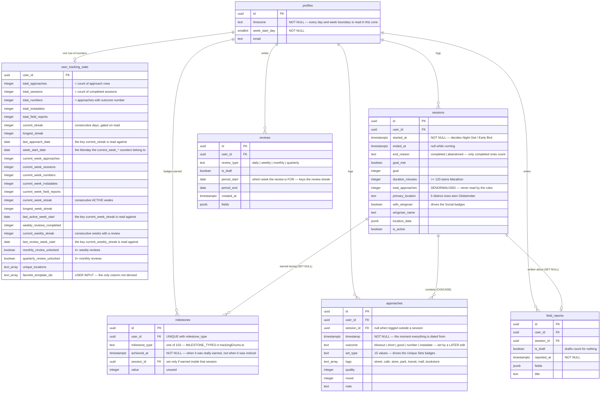
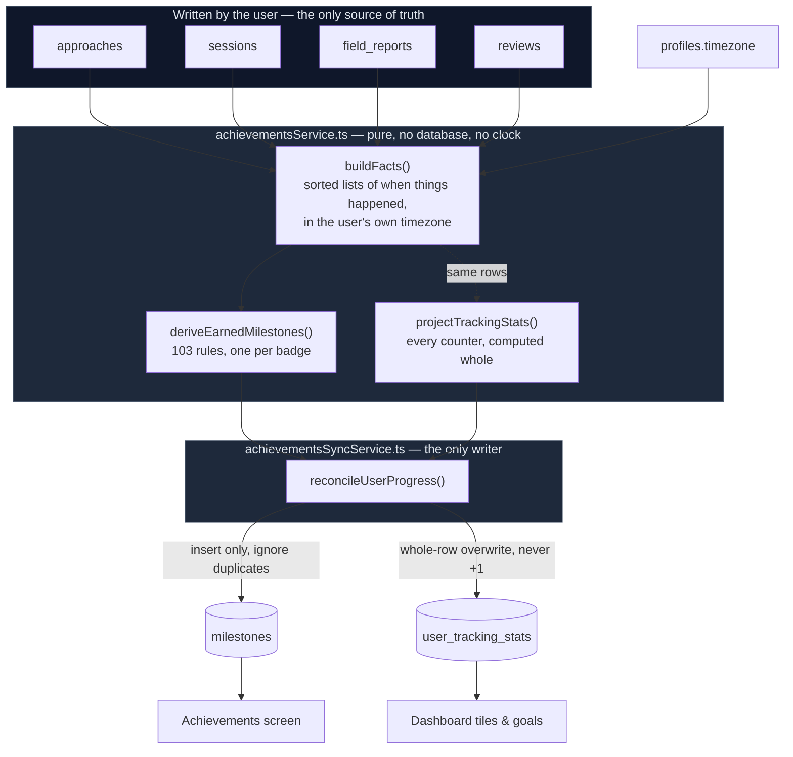

# Achievements & tracking — entity diagram

**Read this first:** the tables split into two halves that must never be confused.

- **Written by the user** (through the app): `sessions`, `approaches`, `field_reports`,
  `reviews`. These are the truth. Everything else is an opinion about them.
- **Derived by the server**: `milestones` (badges) and `user_tracking_stats` (counters). Both are
  recomputed from the four tables above on every write. Neither is ever an *input* to anything.

That split is the fix described in `docs/plans/achievement_counters.md`. Badges used to be handed
out at the instant a `+1` counter crossed a threshold, so a missed instant meant a badge lost
forever — and the counters had drifted in both directions.

Columns below are the live production schema, read from `information_schema` on 2026-08-27.

---

## The tables

### Relationships that matter

| Relationship | On delete | Why it matters |
|---|---|---|
| `approaches.session_id → sessions.id` | **CASCADE** | Deleting a session really deletes the approaches inside it, so the counters must go down. Nothing tells the stats row that rows disappeared — which is why it is recomputed rather than adjusted. |
| `milestones.session_id → sessions.id` | SET NULL | A deleted session must never take a badge with it. Badges are insert-only. |
| `field_reports.session_id → sessions.id` | SET NULL | The report survives its session. |
| `milestones (user_id, milestone_type)` | UNIQUE | This is what makes awarding safe to repeat on every write: a second award is a no-op and `achieved_at` is never rewritten. |

---

## How a badge is decided

**Every arrow points away from the source rows.** There is no arrow back into `buildFacts` from
either derived table — that absence is the guarantee. A rule that read a counter could inherit its
drift; none can, because the counters are not in scope.

---

## What calls the writer

Every mutation in `src/tracking/trackingService.ts` ends in the same call, and nothing else awards
a badge (enforced by `tests/unit/architecture.test.ts`):

| Function | Why it reconciles |
|---|---|
| `createApproach` | a new approach can cross any approach threshold |
| `updateApproach` | **the outcome is set here, one tap after the approach is saved** — this is why the Numbers badges were unreachable before |
| `endSession` | session totals, per-session badges, week streaks |
| `updateSession` | the location, goal and duration a session is judged on can all be edited afterwards |
| `deleteSession` | approaches cascade away; counters go down, badges stay |
| `createFieldReport` / `updateFieldReport` / `deleteFieldReport` | a draft becoming a real report counts, and un-writing one un-counts |
| `createReview` / `updateReview` | weekly and monthly review counts, and the two unlocks |

### Which session a badge belongs to

`milestones.session_id` is **derived, not passed in**: a badge is stamped with the session whose
window (`started_at` → `ended_at`, or still open) contains its `achieved_at`. Most badges are won
mid-session by an approach, so making the caller supply the session meant every approach path had to
remember to — and none of them did, which left every volume badge unattached and session cards
showing no achievements at all.

A badge earned outside any session — a quick-added approach, a field report, a review — correctly
gets `null`.

## Where each thing lives

| Concern | File |
|---|---|
| Which badges exist | `src/db/trackingEnums.ts` → `MILESTONE_TYPES` (103) |
| What each badge is called | `src/tracking/data/milestones.ts` → `ALL_MILESTONES` |
| How each badge is earned | `src/tracking/data/milestoneRules.ts` → `MILESTONE_RULES` |
| Facts and counters, computed | `src/tracking/achievementsService.ts` |
| Writing them back | `src/tracking/achievementsSyncService.ts` |
| Reading and writing rows | `src/db/trackingRepo.ts` |
| Hiding a streak that has gone stale | `src/db/metricsRepo.ts` → `gateStreaks` |
| Checking a live account | `scripts/tracking/audit-achievements.ts` |

All three badge lists are typed against the same union, so a badge missing from any of them fails
the build — and fails `tests/unit/architecture.test.ts` too, because deploys skip type checking.
