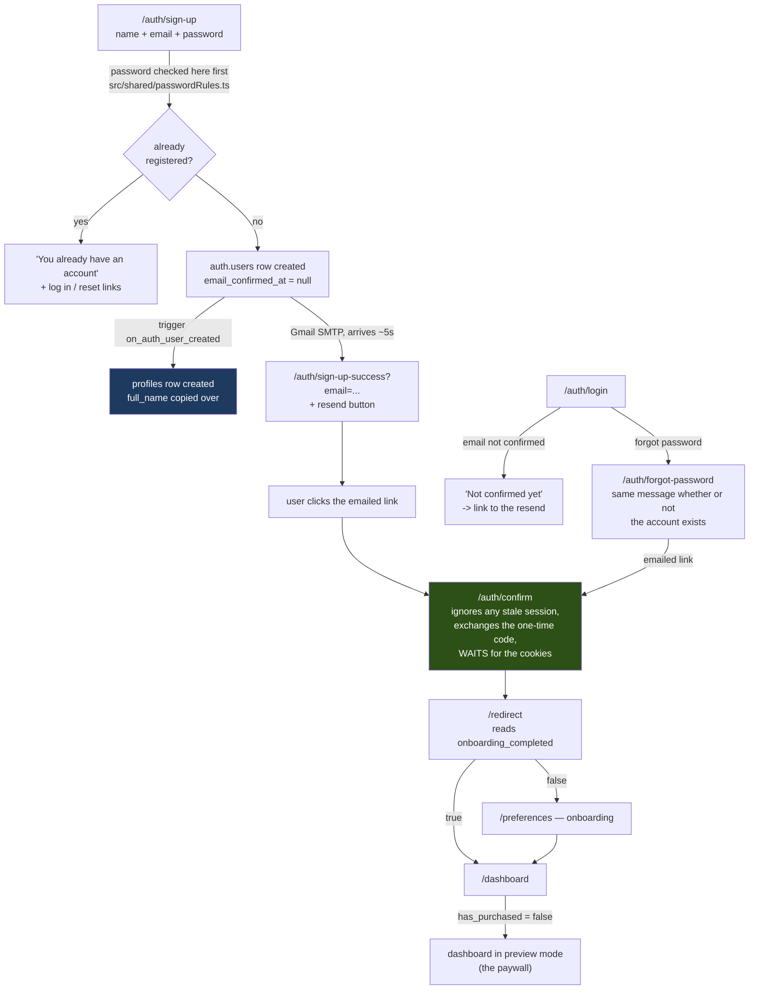

# Authentication — entity diagram

Read from the live database and the live auth config on 2026-09-04. Where this
disagrees with any other document, this one is right.

## In plain language

When someone signs up, Supabase creates a row in its own private `auth.users`
table. That row *is* the account: the email address, the scrambled password, and
whether the address has been confirmed. **Our code never writes to it.**

The instant that row appears, a database trigger creates a matching row in our
`profiles` table and copies over the email and the name they typed. That trigger
is the only thing that ever creates a profile — no application code does. Once
it exists, everything the app knows about a person lives on that row.

Three other tables hang off the account: **purchases** (Stripe writes there),
**beta_testers** (who was let in, and on which invite code), and
**waitlist_emails** (addresses collected before an account exists, so they link
to nothing).

The structural fact worth remembering: **everything points at `auth.users`, not
at `profiles`.** Profiles is a leaf, not a hub. Delete the account and all of it
goes automatically.

## The data

```mermaid
erDiagram
    AUTH_USERS ||--|| PROFILES : "trigger creates, 1:1"
    AUTH_USERS ||--o{ PURCHASES : "pays"
    AUTH_USERS ||--o| BETA_TESTERS : "may be granted"
    BETA_INVITES ||--o{ BETA_TESTERS : "grants slots to"
    WAITLIST_EMAILS }o..o{ AUTH_USERS : "no link (pre-account)"

    AUTH_USERS {
        uuid id PK "Supabase-managed. Never written by us."
        text email
        timestamptz email_confirmed_at "null until the link is clicked"
        jsonb raw_user_meta_data "full_name arrives here from the signup form"
    }

    PROFILES {
        uuid id PK_FK "= auth.users.id, ON DELETE CASCADE"
        text email "denormalised copy; auth.users is authoritative"
        text full_name "copied by the trigger"
        boolean has_purchased "THE paywall flag. NOT user-writable."
        boolean onboarding_completed "drives the /redirect decision"
        int level
        int xp
        text archetype
        text experience_level
        text primary_goal
        text timezone
        jsonb sandbox_settings
        timestamptz subscription_cancelled_at
    }

    PURCHASES {
        uuid id PK
        uuid user_id FK "-> auth.users.id"
        text stripe_session_id
        text status
        timestamptz created_at
    }

    BETA_INVITES {
        uuid id PK
        text code UK
        int max_uses
        int use_count "capped by claim_beta_slot()"
        boolean active
    }

    BETA_TESTERS {
        uuid user_id PK_FK "-> auth.users.id"
        uuid invite_id FK "-> beta_invites.id"
        timestamptz granted_at
    }

    WAITLIST_EMAILS {
        uuid id PK
        text email
        text source "beta_full | premium_teaser"
    }
```

## Signing up, end to end

Every step below has been run against the live site, not reasoned about.



The green box is where three separate bugs lived. It is one route, used by both
the signup confirmation and the password-recovery link, so there is exactly one
place that turns an emailed code into a session.

## Who may write what

| Table | A signed-in user may | Enforced by |
|---|---|---|
| `auth.users` | nothing directly | Supabase |
| `profiles` | UPDATE **27 of 31 columns**, own row only | `profiles_update_own` + a column allow-list |
| `profiles` | **not** `has_purchased`, `id`, `email`, `created_at` | column grant withheld |
| `profiles` | **not** INSERT (trigger only) or DELETE | no policy, no grant |
| `purchases` | read own | RLS |
| `beta_invites` | nothing | no policies at all |
| `beta_testers` | read own; membership only via `claim_beta_slot()` | RLS + SECURITY DEFINER function |
| `waitlist_emails` | nothing | service-role inserts only |

Row rules can say *which rows* you may change, never *which columns*. That is
why `has_purchased` is protected by withholding the column grant rather than by
a policy — before that, any signed-in user could give themselves premium.

## Live settings this depends on

| Setting | Value |
|---|---|
| Site URL | `https://daygame-coach.vercel.app` |
| Email confirmation required | yes (`mailer_autoconfirm` false) |
| Sender | Gmail SMTP, `reachjvc@gmail.com` |
| Emails per hour | 100 |
| Minimum password | 8, with lower + upper + digit |
| Bot protection (captcha) | **off** — deliberate for the beta |
| Tables in `public` | **63** |
| Tables with security off | **0** — `npm run audit:rls` |

## What is NOT proven

- **No password manager has been observed saving a password.** The attributes
  are present and tested; whether iOS Keychain or 1Password acts on them needs a
  human with a phone.
- **Auth on phones is tested as pages, not as a round trip.** The four new
  Playwright projects cover WebKit, Firefox, iPhone and Android — but the
  emailed link is followed only on Chromium, because that needs a live inbox.
- **Nobody has completed onboarding.** Every automated run stops at
  `/preferences`. The five steps after signup remain unwalked.
