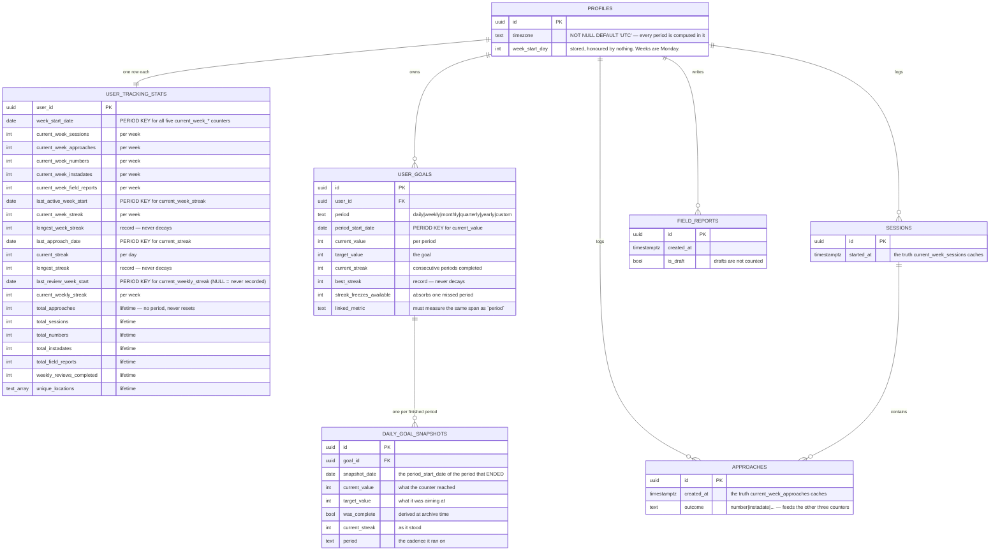
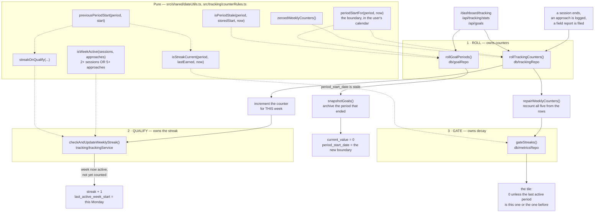

# Counters — entities

> **A counter is two facts, not one: a number, and the period that number
> belongs to. Neither may be read without the other.**

Every box below is a real table; every `period key` column is the second half of
some counter's pair. Built 2026-08-27 — see `docs/plans/counters.md`.

## Entities

## The three responsibilities, and where each lives

Splitting these is the whole design. Any two of them in one function and the
third goes wrong.

**Why three and not one.** Rolling touches counters only, so running it twice
cannot decay a streak twice — two page loads on a Monday are safe. Qualifying
only ever raises a number, so it cannot punish anyone. The gate only ever hides,
so a recovered user gets their streak back without anything writing to the row.
The previous design had all three tangled in three separate `weekChanged` blocks
and produced a streak of 4 from two active weeks.

## What a period is, per cadence

| period | boundary | rolls? |
|---|---|---|
| `daily` | midnight, user's timezone | yes |
| `weekly` | **Monday 00:00**, user's timezone. Sunday night is still last week's. | yes |
| `monthly` | the 1st | yes |
| `quarterly` | 1 Jan / 1 Apr / 1 Jul / 1 Oct | yes — it did not until 2026-08-27 |
| `yearly` | 1 January | yes |
| `custom` | none — a milestone runs to `custom_end_date` | **never** |

`custom` is absent from `shared/dateUtils.GoalPeriod` on purpose: a milestone
cannot be passed to period arithmetic, which makes "zeroing a milestone"
unrepresentable rather than merely unlikely.

## The rule that keeps a linked metric honest

`metricFitsPeriod(metricId, period)` — a metric's **window is its cadence**:

| metric window | may back a goal whose period is | because |
|---|---|---|
| `weekly` | `weekly` | same span |
| `cumulative` | `custom` only | a lifetime total refills any goal that rolls |
| `current` (1RM, body weight) | `custom` only | a level is not a count |
| `streak` | nothing | display-only; not in `LINKED_METRICS` |
| `daily`, `monthly` | nothing yet | no metric has these windows |

Enforced in `createGoal`, `createGoalBatch` and `updateGoal` (throws
`GoalMetricPeriodError` → HTTP 400), and both goal forms filter their pickers by
the same function.

## Health counters

Computed fresh from `workout_logs`, `nutrition_logs` and `sleep_logs` on every
read, and stored nowhere — deliberately. They are already derived from the rows,
which is the property the daygame counters spent two rewrites buying; storing
them would add a cache to keep in sync.

| metric | window | dated by |
|---|---|---|
| `gym_sessions_weekly`, `cardio_sessions_weekly`, `running_sessions_weekly`, `mobility_sessions_weekly`, `yoga_sessions_weekly` | this week | `workout_logs.logged_at` |
| `protein_days_hit_weekly`, `calorie_days_hit_weekly` | this week, **per day** | `nutrition_logs.logged_at`, summed within each of the user's days |
| `nutrition_quality_avg_weekly`, `sleep_hours_avg_weekly` | this week | `logged_at` |
| `consecutive_training_weeks`, `consecutive_cardio_weeks` | streak | weeks containing a `logged_at` |
| `*_cumulative`, `*_1rm`, `body_weight_current`, `longest_run_km` | no period | — |

Every one of the period-scoped eleven takes the account holder's timezone as a
required argument. Until 2026-08-28 none of them did — the file did not contain
the word — and the two streaks could only ever return 0.

## The six questions, asked of each counter family

From `.claude/rules/finished-work.md`. A blank cell is work, not a tidy table.

| | daygame counters | goal counters | health counters |
|---|---|---|---|
| **Whose clock?** | the user's, from `profiles.timezone` (NOT NULL) | the user's | the user's, since 2026-08-28 |
| **Which two facts must agree?** | count ↔ `week_start_date`; streak ↔ `last_active_week_start` | `current_value` ↔ `period_start_date` | none stored — recomputed from rows each read |
| **What can be written that shouldn't?** | nothing: the row is overwritten by a projection, never incremented | a `linked_metric` whose window ≠ the goal's period — refused on write | n/a |
| **Who else can write it?** | the service-role key bypasses RLS, so every guarantee here is advisory for backend code | same | same |
| **Does the name mean something else here?** | `current_streak` is **days**, `current_week_streak` is weeks, `current_weekly_streak` is **reviews**. Three streaks, three meanings, similar names. **This is a real trap and it is not fixed.** | `current_value` is this period only; lifetime is in `daily_goal_snapshots` | — |
| **What did I claim was impossible?** | zeroing a milestone: `custom` is not in `GoalPeriod`, so it cannot be passed to period arithmetic | same | a streak that decays on write: `streakRun` has no clock |

## Invariants a test now enforces

- Every `current_*` column on `user_tracking_stats` declares a period key —
  `tests/unit/architecture.test.ts`, verified by mutation.
- `ROLLING_PERIODS ∪ {custom}` equals the `goal_period` Postgres enum, and
  `dateUtils.GoalPeriod` equals `ROLLING_PERIODS` — `tests/unit/db/goalPeriods.test.ts`.
- A week is identified by its Monday, and two different weeks never share an
  identity — `tests/unit/shared/periodEquivalence.test.ts`.
- No metric fits more than one cadence — `tests/unit/goals/metricPeriodFit.test.ts`.
- No new hand-rolled week boundary, and no new date derived by converting to UTC
  first — `tests/unit/architecture.test.ts`, both verified by mutation, both with
  allowlists that can only shrink.
- Counters keep their shape as the clock moves: totals never fall, a weekly count
  resets only when the week does, a shown streak never returns from zero on its
  own — `tests/unit/tracking/counterShapes.test.ts`, 45 days at 6-hour steps
  through both DST switches.
