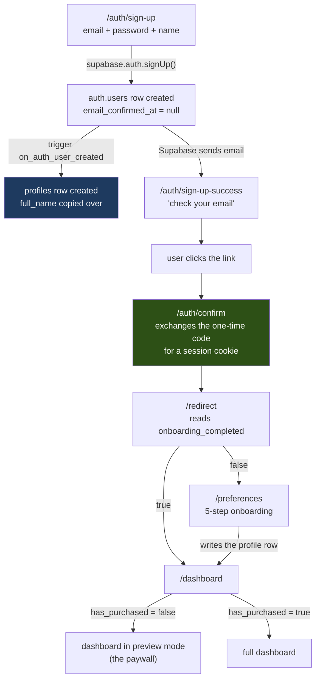

# Account & onboarding — entity diagram

Everything here was read from the live database on 2026-08-28, not from a doc.
`tests/integration/schema.sql` disagrees with it in several places; where they
differ, this file is right (see *Known drift* at the bottom).

## In plain language

When someone signs up, Supabase creates a row in its own private `auth.users`
table. That is the account: the email address, the password hash, whether they
have confirmed their email. **We never write to it directly.**

The moment that row appears, a database trigger fires and creates a matching row
in our `profiles` table, copying across the email and the name they typed. That
is the only way a profile is ever created — no application code inserts one.
Everything the app knows about a person as a *user of this product* — their
onboarding answers, their level, their settings — lives on that profile row.

Three other tables hang off the account:

- **purchases** — one row per payment. Stripe writes here.
- **beta_testers** — who was let into the beta, and which invite code they used.
- **waitlist_emails** — addresses collected when the beta was full. Not tied to
  an account at all, because these people don't have one yet.

The important structural fact: **everything points at `auth.users`, not at
`profiles`.** Profiles is a leaf, not a hub. Deleting an account cascades
everywhere automatically.

## The diagram

```mermaid
erDiagram
    AUTH_USERS ||--|| PROFILES : "trigger creates, 1:1"
    AUTH_USERS ||--o{ PURCHASES : "pays"
    AUTH_USERS ||--o| BETA_TESTERS : "may be granted"
    BETA_INVITES ||--o{ BETA_TESTERS : "grants slots to"
    WAITLIST_EMAILS }o..o{ AUTH_USERS : "no link (pre-account)"

    AUTH_USERS {
        uuid id PK "Supabase-managed. Never written by us."
        text email
        timestamptz email_confirmed_at "null until the link is clicked"
        jsonb raw_user_meta_data "full_name arrives here from the signup form"
    }

    PROFILES {
        uuid id PK_FK "= auth.users.id, ON DELETE CASCADE"
        text email "denormalised copy, may go stale"
        text full_name "copied from raw_user_meta_data by the trigger"
        boolean has_purchased "THE paywall flag. Not user-writable."
        boolean onboarding_completed "drives the /redirect decision"
        text difficulty
        int level
        int xp
        int scenarios_completed
        int age_range_start
        int age_range_end
        text archetype
        text secondary_archetype
        text tertiary_archetype
        text experience_level
        text primary_goal
        text preferred_region
        text secondary_region
        boolean user_is_foreign
        boolean dating_foreigners
        boolean speaks_home_language
        text ethnicity
        int age
        text voice_language
        text preferred_language
        text timezone
        smallint week_start_day
        text curve_style
        timestamptz created_at
    }

    PURCHASES {
        uuid id PK
        uuid user_id FK "-> auth.users.id"
        text stripe_session_id
        text stripe_subscription_id
        text product_id
        int amount_cents
        text status
        text subscription_status
        timestamptz created_at
    }

    BETA_INVITES {
        uuid id PK
        text code UK
        int max_uses
        int use_count "capped by claim_beta_slot()"
        boolean active
        timestamptz created_at
    }

    BETA_TESTERS {
        uuid user_id PK_FK "-> auth.users.id"
        uuid invite_id FK "-> beta_invites.id"
        timestamptz granted_at
    }

    WAITLIST_EMAILS {
        uuid id PK
        text email
        text source "beta_full | premium_teaser"
        timestamptz created_at
    }
```

## How a person moves through it



The green step is the one that did not exist before this work: without it the
one-time code in the email was never redeemed, so a user who confirmed their
address was bounced straight back to the login page.

## Who is allowed to write what

| Table | Signed-in user may | Enforced by |
|---|---|---|
| `auth.users` | nothing directly | Supabase |
| `profiles` | UPDATE **25 of 29 columns**, own row only | `profiles_update_own` + a column allow-list |
| `profiles` | **not** `has_purchased`, `id`, `email`, `created_at` | column grant withheld |
| `profiles` | **not** INSERT (trigger only) or DELETE | no policy, no grant |
| `purchases` | read own | RLS |
| `beta_invites` | nothing | no policies at all |
| `beta_testers` | read own | `beta_testers_select_own`; membership granted only by `claim_beta_slot()` |
| `waitlist_emails` | nothing | no policies; service-role inserts only |

The column allow-list matters more than it looks. Postgres row policies can say
*which rows* you may change, but never *which columns*. Before this was fixed,
`profiles_update_own` let a signed-in user change any column of their own row —
including `has_purchased`, the single flag the whole paywall reads.

## Known drift from `tests/integration/schema.sql`

That file is a hand-maintained mirror used to build the local test database. It
is wrong about `profiles` in two ways, both verified against production:

1. **It declares eight columns that do not exist:** `sandbox_settings`,
   `subscription_cancelled_at`, `avatar_url`, `updated_at`, `primary_archetype`,
   `secondary_archetypes`, `region`, `secondary_regions`.
2. **It declares ~19 foreign keys pointing at `profiles(id)`.** Production has
   **zero** — every one of those tables references `auth.users(id)` instead.

Consequence worth knowing: `src/db/settingsRepo.ts` reads and writes
`profiles.sandbox_settings`, which does not exist, so those calls fail at runtime
with `42703: column profiles.sandbox_settings does not exist`. The integration
tests pass because they run against the mirror, where the column is real.
