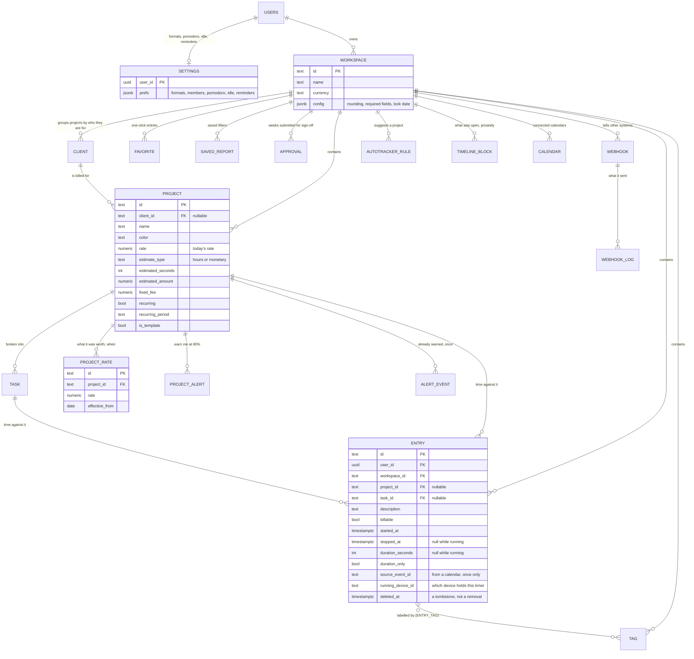
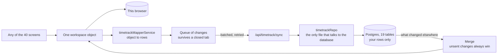

# The time tracker's data, and how it hangs together

Nineteen tables, all live, and exactly one workspace per person — the database enforces that with a unique
index, after a day of testing left 47 workspace rows on a single account and three of them live at once. Everything here is per person: each table carries a `user_id`, and the database
itself refuses to hand a row to anyone else — that is Row Level Security, and there are four rules on every
table (read, create, change, delete), all saying "only your own".

## The shape of it

## The four decisions worth knowing

**Ids are text, not `uuid`.** Every id is made on the device that creates the thing, so two phones with no
signal can both add an entry and neither has to lose. New ids are uuids — but a workspace carried over from
the old counter era has ids like `"101"`, and a `uuid` column would have rejected the whole import at exactly
the moment somebody's history was in the balance.

**Rate history is its own table.** An hour tracked in March at 90/h is worth 90, even if the project charges
120 today. A single `rate` column on the project would silently rewrite every past invoice each time the rate
changed.

**Nothing is really deleted.** Every table has `deleted_at`. A phone that was offline when you deleted
something needs to be *told* it is gone; otherwise it sees a row it still has, decides the server forgot, and
helpfully uploads it again.

**Two JSON columns, and only two.** `workspace.config` and `settings.prefs` hold preferences — rounding
rules, date formats, pomodoro lengths. They are read and written whole and never filtered or added up.
Everything you might ask a question about — entries, projects, rates — is real columns, because a report has
to be able to ask.

## Only one timer runs at a time

The app shows one running timer and only ever looks for the first one, so a second is not a feature — it is an
invisible timer, still counting, until somebody notices their week has too many hours in it. Two devices with
no signal can each start one. When they meet, the newer start wins and the older is stopped at the moment the
newer began, which is what would have happened had they been online. The app says so when it happens rather
than quietly correcting the numbers.

## What is not stored, deliberately

- **Imported calendar events.** They are a copy of someone else's calendar and are re-fetched. Keeping them
  means serving meeting titles that stopped being true weeks ago.
- **The entry's `userId` as the app sees it.** That is the member who logged the time, and there is one
  member. It is rebuilt from the workspace on the way back, so it can never drift.
- **The iCal secret address**, unless you explicitly ask us to remember it. That link *is* the key to your
  whole calendar.

## How a change gets from your screen into these tables

The app keeps everything in one object, so there is exactly one translation between that object and these
tables. That is why all forty features got real storage at once instead of forty screens each learning to
save themselves — and why there is one place to look when something does not come back.

## Rules the database enforces, so no client has to be careful

| Rule | Why it exists |
|---|---|
| One live workspace per person | A browser with nothing saved invents one before it hears from the server. Two of them, and which one you see is a race. |
| An entry cannot stop before it starts | |
| A stopped entry must have a duration | A running one must not — it is worked out from the clock, so a stored number can never disagree with it. |
| The same calendar event cannot import twice | |
| A webhook must post over https | |
| A budget alert is between 1% and 500% | |
| A project rate can only change once per day | Two rates on the same day is a question with no answer. |
| Nothing is negative: rates, durations, budgets | |

The server also decides which workspace an incoming row belongs to, rather than trusting the caller. A person
has one, so there is never any ambiguity — and no client, however old or confused, can send a row pointing at
a workspace that does not exist.
