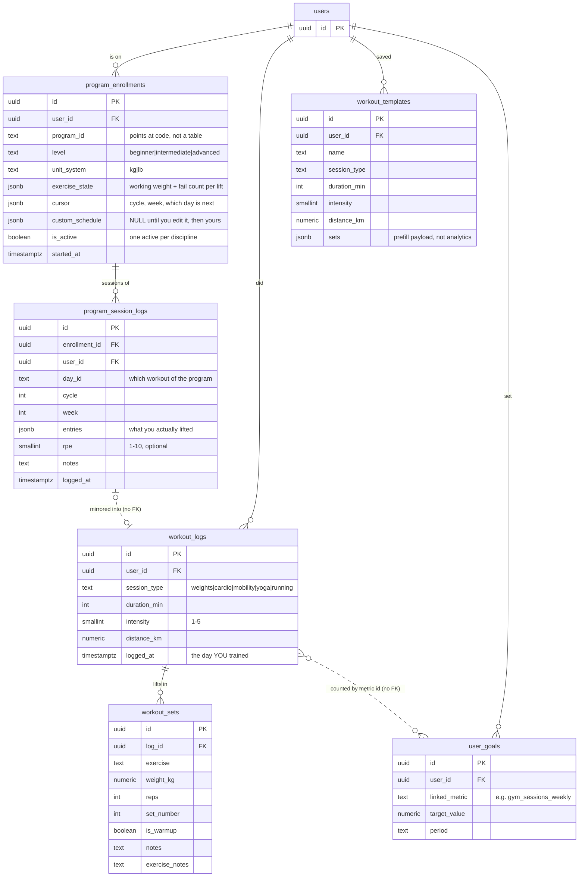

# Training & workouts — what is stored where

Every table below is drawn from the migrations, not from memory:
`20260305_create_health_tracking_tables.sql`, `20260715_create_workout_templates.sql`,
`20260716_add_workout_set_details.sql`, `20260618_create_program_tables.sql`,
`20260818_program_custom_schedule.sql`.

## The one thing to understand first

**There is no table of training programs.** StrongLifts 5×5, 5/3/1, Couch to 5K and
the other ten are hand-written TypeScript files in `src/programs/data/`, checked into
the repo. `program_enrollments.program_id` is just a piece of text — `"stronglifts-5x5"` —
that points at one of them.

That is deliberate. A program is a *citation*: somebody wrote it, it has a source, and
the numbers in it are not ours to edit. Keeping them in code means a correction reaches
everybody on the next deploy. What lives in the database is only **your** relationship
to a program: which one you are on, what weights you are lifting, and how far through
you are.

The one exception is `custom_schedule`. The moment you change anything — swap a lift,
rename a day — the whole reshaped program is copied into your own row and becomes
yours. Before that it is `NULL` and you keep getting the catalogue's corrections.

## The diagram

## Reading it in plain language

**Two ways a workout gets recorded, one place it ends up.**

1. **On a program.** You are enrolled (`program_enrollments`). You log today's session
   on `/programs`; that writes a `program_session_logs` row, and the engine bumps the
   weights inside `exercise_state` for next time. Then — and this is the join that makes
   everything else work — the same session is **also** written as a `workout_logs` row
   with its `workout_sets`.
2. **Off a program.** The free-form logger writes straight to `workout_logs` +
   `workout_sets`, with no enrollment involved. `workout_templates` just prefills that
   form; it records nothing you did.

So `workout_logs` is the one place every workout lands, whichever door you came through.
That is why the tracking dashboard's "Gym Sessions This Week" tile and any goal linked
to `gym_sessions_weekly` both work without knowing programs exist.

**The two dotted lines are the two places to be careful.**

- `program_session_logs ⇢ workout_logs` is a **mirror with no foreign key**. Logging a
  program session creates a `workout_logs` row, but nothing in the database records that
  the two are the same event. Delete the `workout_logs` row and the program session
  stays; delete the enrollment and the mirrored workouts stay. This is also why the
  free-form logger warns you when a workout already exists on that day — the database
  cannot tell a genuine second session from the same one written up twice, so the person
  is asked. See `workoutsOnDate` in `src/health/healthService.ts`.
- `workout_logs ⇠ user_goals` is joined **by a text metric id**, not a key. A goal says
  "count `gym_sessions_weekly`", and something else knows that metric means "rows in
  `workout_logs` since Monday". Rename that string in one place and the goal silently
  counts nothing.

**"The program I am on" now has one owner, with a pointer to it.** The Life Mastery
plan is localStorage and used to store only the day *names* a program had when you
pressed start — no program id, no enrollment reference — so the plan and
`program_enrollments` were two claims about one fact with no way to disagree out loud.
The plan's workout routine now carries `program: { programId, enrollmentId, label,
startedAt }`. The enrollment decides everything; the plan holds a reference. Ending a
program nulls the reference and **keeps the written week** — not tracked is not the same
as not real. A week typed by hand has `program: null`, which stays a first-class case.

Two things still have no structural guard, only visibility:

- **Enrollments deactivate only within a discipline**, and three flows create them (the
  Life Mastery Templates tab, build-your-own, and the goals planner's
  `ensureEnrollment`), so old picks accumulate and keep prescribing. `RunningPrograms`
  states every one of them — name, level, started date, **last logged**, and an End
  button — on all three surfaces. `lastLoggedAt` is derived per read from
  `program_session_logs`, never stored, and a program with no sessions says so in
  words: *never logged — you may have started this and forgotten it.*
- **Nothing reconciles the written week against the prescribed one.** When the plan's
  days match no running program the band says so rather than overwriting either — a
  hand-written week is not wrong because you are also on a program.

**Ending a program is a change of status, not a deletion.** `program_session_logs`
cascades from `program_enrollments`, so deleting an enrollment erases every session
ever logged on it — which is what "End program" used to do. It now sets
`is_active = false`. Two schema facts hold that up and are pinned by
`tests/integration/db/programRepo.integration.test.ts`: the cascade is real (so
nobody concludes a hard delete is safe again), and `uq_program_enrollments_active`
is **partial** (`… WHERE is_active`), which is what lets a finished run of a
program sit beside a new one. Erasing still exists — `deleteEnrollmentPermanently`
— but only for a program already ended, and the repo refuses it otherwise.

**One lift outlives the programs it was trained under.** `summariseProgression`
reads one enrollment, so it resets when you switch. `liftHistory` in
`src/health/healthService.ts` reads `workout_sets`, which spans program sessions
and loose workouts alike, joined on `exercise.toLowerCase().trim()` — the same key
`detectPersonalRecords` uses, so a PR and a history cannot disagree about what
counts as the same lift. Both produce the one `LoadPoint` type, so both draw
through the one `Sparkline`.

**Whose clock.** `workout_logs.logged_at` is a real instant, but it is written from the
date *you* picked in *your* timezone (`loggedAtForEntry`), and everything reads it back
in local time (`localDateKey`). A 23:30 workout belongs to the day you trained, not to
whatever day UTC had reached. Covered by `tests/unit/health/workoutDate.test.ts`.

**Who can read it.** Every table here is own-row only: `auth.uid() = user_id`, with
`workout_sets` reaching through its parent `workout_logs`. Nothing is shared, earned, or
comparable between users, so there is no cross-user policy to get wrong. The service-role
key bypasses all of it, as always — that is a property of the key, not of these tables.

## Where the code for each piece lives

| Thing | Owner |
|---|---|
| The programs themselves | `src/programs/data/` (TypeScript, cited) |
| Progression maths (pure) | `src/programs/programsService.ts` |
| Enrollment + logging + the mirror | `src/db/programRepo.ts` |
| Your edits to a program | `src/programs/customize.ts` |
| Free-form workouts, streaks, heatmap, PRs | `src/health/healthService.ts` |
| Both screens | `/programs` (`app/programs/page.tsx`) |
