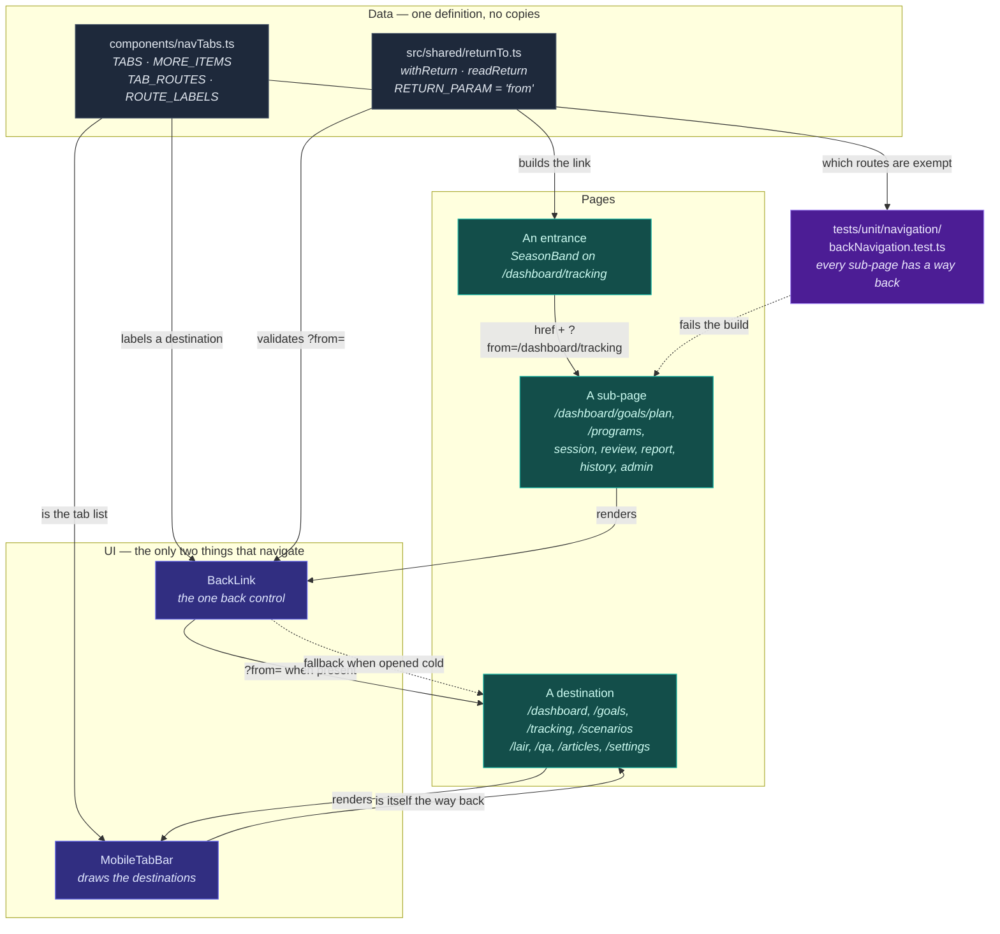

# Back navigation — one way back, on every screen

**Status: executed.** Every phase below is done and verified. The record of
what was attempted, what was found, and what is still open is at the bottom.

## What this was

The app had thirteen hand-written back links, each with its destination typed
into the component that drew it. So a screen sent you to the same place however
you arrived: open the Life Mastery plan from the tracking page and "back" took
you to Goals, which is not where you were. Two of them said "Back to Dashboard"
while pointing at Tracking. Two screens had no way back at all, and nothing
stopped the next screen from shipping without one.

Four changes:

1. **One back control**, used everywhere, instead of thirteen copies.
2. **It goes where you came from.** A link that sends you somewhere carries its
   own address; the back control on the far side uses it. Opened cold — typed
   URL, bookmark — it falls back to that page's home.
3. **The screens with no way back got one.**
4. **A test that fails** when a new page ships without one.

### What you see now

- One back control, same place, same look, naming its destination: `← Tracking`,
  `← Goals`.
- Open your plan from the tracking page → back returns to **Tracking**. Open it
  cold → back says **Goals**. Both verified in the browser.
- The live session screen has a way out that does not end the session — the
  dashboard lists it as "In progress" with a Continue button.
- Nothing changed on the top-level pages: Dashboard, Goals, Tracking, Scenarios,
  Lair, Ask Coach, Articles, Settings are destinations, and the tab bar is their
  navigation.

### Deliberately not done

- No breadcrumb trail, no history stack. One step back.
- In-flow "previous step" buttons untouched — they are not page navigation.
- No back control on the `/test/*` prototypes. They are not product.
- Two end-of-flow call-to-action buttons ("Back to Dashboard" on the scenarios
  and inner-game summary pages) left as buttons. They are an offer to go
  somewhere, not the page's way back, and both pages already show the tab bar.

---

## Milestones — all complete

### M1 — one back control, used by every page that had one ✅

- `components/BackLink.tsx` — the only back control in the app.
- Seven call sites replaced across five files.

Acceptance test: `tests/unit/navigation/backNavigation.test.ts` →
*"only BackLink pairs a Link with a back arrow"*. Passing.

### M2 — back goes where you came from ✅

- `src/shared/returnTo.ts` — `withReturn` / `readReturn`.
- `BackLink` prefers the return address, falls back to its `fallback` prop.
- `SeasonBand` (the tracking page's plan band) passes its address on all three
  of its links.

Acceptance tests: `tests/unit/navigation/returnTo.test.ts` (11 tests, including
every rejection case) and a browser walk: tracking → plan → back → tracking.

### M3 — the screens with no way back got one ✅

- `/dashboard/tracking/session` — `← Tracking`, leaves the session running.
- `/programs` — `← Dashboard`.
- `/admin/ai-usage` — `← Dashboard`.

### M4 — it cannot regress ✅

- `tests/unit/navigation/backNavigation.test.ts` walks every route outside
  `app/test`, resolves its component tree two levels deep, and asserts each
  route renders `<BackLink` or `<MobileTabBar`.
- Exemptions are **derived, never typed**: a tab-bar destination, a route the
  app redirects you into (a gate — `/preferences` is one, because the dashboard
  redirects there until onboarding is done), a bare `redirect()` shim with no
  UI, or a pre-login `/auth/` page.
- `components/navTabs.ts` — the tab list moved out of `MobileTabBar.tsx` so the
  bar and the test read the same data.

**Verified by breaking it:** deleting the `BackLink` from `/programs` makes the
test fail with `no way back from: /programs`; restoring it makes it pass. The
first version of the guard did **not** fail that check — a leftover import
satisfied a `.includes("BackLink")` test — which is why it now matches
`<BackLink` rather than the bare word.

### M5 — cleanup ✅

Removed, all confirmed unused by eslint: `ArrowLeft` from three files, `Link`
from four, plus two pieces of dead code that predate this work — the `Lock`
icon import and the `nonFavorites` array in `FieldReportPage`, and an unused
`userId` prop destructure in `SessionDetailPage`.

No tests were deleted. None had asserted on the old markup.

---

## Test results

```
unit    3770 passed, 1 skipped, 0 failed   (110 files)
new     14 tests across tests/unit/navigation/
lint    0 problems in every changed file
types   no new errors; two pre-existing ones remain in
        WeeklyReviewDialog (badge tiers) and DailyReviewPage
        (VoiceRecorderButton props), both present at HEAD
```

---

## Manual blockers — each attempted, with the result

**B1. Verifying signed-in pages in a browser.** ✅ Done. Signed in as
`test-user-b@daygame-coach-test.local`. Confirmed: the tracking page's plan
links carry `?from=%2Fdashboard%2Ftracking`; the plan's back control reads
"Tracking" and returns there; opened cold it reads "Goals"; the session page and
`/programs` both render a back control.

**B2. Running the Playwright e2e suite.** ⚠️ Not run. It needs the dev server
plus the `setup` project to write `tests/e2e/.auth/user.json`, and this session
had two dev servers fighting over the Turbopack lock twice already. The unit
route-sweep is the guard that runs in CI and it covers the same invariant; a
browser walk covered the behaviour. **For you to run once:** `npm run test:e2e`.

**B3. Confirming a live session survives navigating away.** ✅ Resolved by
reading the code that renders the resume path, not by guessing:
`RecentSessionsCard` shows an active session as "In progress" with a
**Continue** button linking back to `/dashboard/tracking/session`. Leaving is
recoverable. Worth one real check with an actual session running.

**B4. `/admin/ai-usage` access.** ⚠️ Partially. The page is behind an admin-key
prompt, so the back control was added and typechecked but not seen rendered.
Three lines, low risk.

**B5. Committing and deploying.** Yours. Nothing here is committed.

**B6. Everything in this plan was lost once and rebuilt.** A `git reset --hard`
during the session removed the untracked files — `BackLink.tsx`, `navTabs.ts`,
`returnTo.ts`, both test files and this plan — and reverted the edits. All of it
was recreated and re-verified. **Commit early**; untracked work is one command
from gone.

---

## Open questions — each with a recommendation

**Q1. Should the live session screen have a back control at all?**
**Answered: yes**, labelled `← Tracking`. Shipped, on the strength of B3 — the
session persists and the dashboard offers Continue.

**Q2. What may the return address contain?**
**Answered: internal paths only.** One leading `/`, not `//` or `/\`, no
control characters, no whitespace, ≤ 512 characters; anything else is ignored
and the fallback used. This is an open-redirect guard: without it,
`?from=https://evil.example` renders a back control that walks the user off your
domain onto somebody else's login form. Every rejection case has a test.

**Q3. Label: "Back", or the name of the destination?**
**Answered: the destination**, falling back to `← Back` when it has no name.
Names live in `ROUTE_LABELS` in `navTabs.ts`.

**Q4. Is the browser's own back button enough on mobile?**
**Answered: no.** Installed to a home screen there is no browser chrome.

**Q5. `/programs` is live but in no menu — where should its back go?**
**Recommendation, shipped: `/dashboard`.** Still open: Programs is reachable
only by typing its URL. Add it to the tab bar's "More" menu as separate work.

**Q6. Should the `/test/*` prototypes be included?**
**Answered: no.** They are not product. The vice module gets one when it gets a
real route.

### Still open

**Q7. The two call-to-action buttons.** `ScenariosPage` and inner-game
`SummaryPage` each render a styled "Back to Dashboard" button that is not a
`BackLink`, so they cannot honour a return address. They are on the guard's
allowlist. **Recommendation:** leave them until something links into those pages
from more than one place; converting them now risks a visual regression for no
behaviour gained.

**Q8. Should `AppHeader` count as a way back?** The guard accepts the tab bar
but not the header, which also carries a Dashboard link. **Recommendation:**
keep it strict. The header is app-wide navigation, not "back", and every page
that renders the header renders the bar too, so nothing is currently affected.

**Q9. Where does the tab bar go on sub-pages?** It is hidden on
`/dashboard/goals/setup`, `/dashboard/goals/plan` and
`/dashboard/tracking/review` because those have their own bottom bars.
**Recommendation:** leave as is — each of those three now has a `BackLink`, so
the invariant holds without the bar.

---

# For execution — what was built

## New files

```
components/navTabs.ts                        tab list + TAB_ROUTES + ROUTE_LABELS
components/BackLink.tsx                      the one back control
src/shared/returnTo.ts                       withReturn / readReturn
tests/unit/navigation/returnTo.test.ts       11 tests, security cases included
tests/unit/navigation/backNavigation.test.ts 3 tests, the route sweep + DRY guard
```

## Changed files

```
components/MobileTabBar.tsx                        imports the tab list
src/tracking/components/FieldReportPage.tsx        2 back links -> BackLink
src/tracking/components/SessionDetailPage.tsx      2 back links -> BackLink
src/tracking/components/DailyReviewPage.tsx        1 back link  -> BackLink
src/tracking/components/WeeklyReviewPage.tsx       1 back link  -> BackLink
app/dashboard/tracking/history/page.tsx            1 back link  -> BackLink
src/goals/components/north-star/NorthStarFlow.tsx  keeps backHref/backLabel as fallback
src/goals/components/north-star/SeasonBand.tsx     passes the return address
app/dashboard/tracking/session/page.tsx            new back control
app/programs/page.tsx                              new back control
app/admin/ai-usage/page.tsx                        new back control
```

## How a back control is added to a new page

```tsx
import { BackLink } from "@/components/BackLink"

<BackLink fallback="/dashboard/tracking" fallbackLabel="Tracking" />
```

`fallback` is where to go when the link carried no address. Nothing else is
needed — the Suspense boundary `useSearchParams` requires is inside the
component.

## How a link passes where it came from

```tsx
import { withReturn } from "@/src/shared/returnTo"

<Link href={withReturn("/dashboard/goals/plan", "/dashboard/tracking")}>Open your plan</Link>
```

---

# Entity diagram — back navigation

Who owns what, and which way the arrows point. Nothing knows a destination
except the page that renders the control and the link that carried an address.



**Reading it:** a destination needs no back control because the bar is on it. A
sub-page must render `BackLink`, and `BackLink` gets its destination from the
address the entrance attached — falling back to the page's own home when there
isn't one. `navTabs.ts` is the single place that knows which routes are
destinations, so the bar, the labels and the guard can never disagree.

**Where a failure can still hide:** `BackLink` reads the address at render time
and does not validate that the destination exists — a link carrying
`?from=/a-route-that-was-deleted` renders a back control to a 404. The guard
checks that a control exists, not that it lands somewhere. Adding "the return
address resolves to a real route" is a natural second test if that ever bites.
