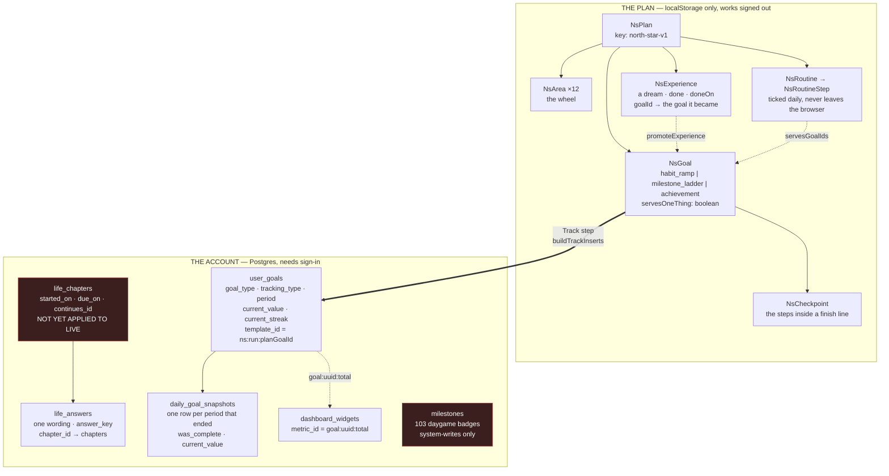
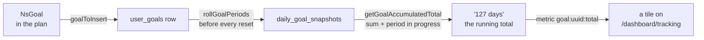
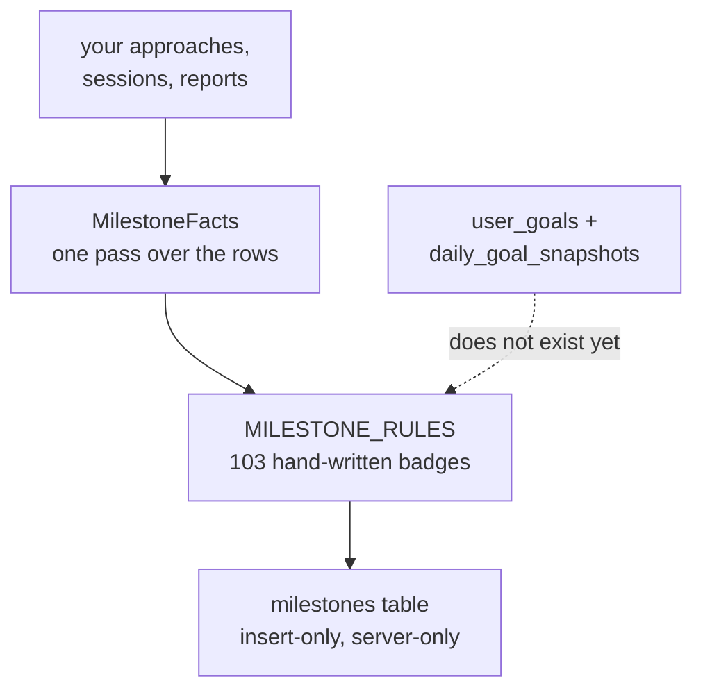

# The goal area — what exists, where it lives, and what points at what

Written 2026-09-03, from the code rather than from memory. Covers the one thing,
goals, dreams, tracking history and achievements.

## The one picture

Three storage worlds, and most of the confusion in this area comes from not
knowing which world a thing lives in.

**Red = the two live gaps.** `life_chapters` exists in code and not in the
database, which is why the One Thing page cannot read your one thing right now.
`milestones` covers daygame only and has no rule that looks at a goal.

## The crossing, and what survives it

The Track step is the only place the browser world becomes the account world.
It is one-way and manual.

What crosses: title, why, area, target, ramp steps, ladder, target date, values.
**What does not cross: which one thing it serves.** That is `servesOneThing`, a
boolean in the browser — so a new phone loses it, and it never said *which* one
thing. Phase 2 of `goal-categorisation.md` is the column that fixes it.

## Shape — the three the app has, and where each is stored

A goal row does **not** store its shape. It is read from two columns, and
`src/goals/data/goalShapes.ts` is now the only place that reads them.

| Shape | In the plan (`NsGoal.type`) | On a row (`goal_type` / `tracking_type`) | You said |
|---|---|---|---|
| Practice | `habit_ramp` | `habit_ramp` **or** `recurring` / counter | your systems |
| Target | `milestone_ladder` | `milestone` / counter | the numbers |
| Finish line | `achievement` | `milestone` / boolean | your dreams |

`recurring` and `habit_ramp` are the same shape. The first is what the goals
hub's own form writes; the second is what Life Mastery writes.

## The five readings of one goal

Any Practice goal can already be shown five ways. All five exist and work; only
the first is offered anywhere obvious.

| View | Means | Resets? |
|---|---|---|
| `period` | this week's count | yes, every Monday |
| `total` | **every period ever, plus this one** | **never** |
| `streak` | consecutive complete periods | to 0 on a miss |
| `percent` | this period against target | yes |
| `best` | best streak reached | never |

## Achievements today, and the shape of the generalisation

The architecture is already right and is worth copying rather than replacing:
badges are **recomputed from your own rows every time**, never incremented, so a
missed award repairs itself on the next run. What is missing is any rule that
takes a goal as input — which is why a goal you create yourself can never earn
one.

## Where each thing actually lives

| Thing | File |
|---|---|
| shape, and the one reading of it | `src/goals/data/goalShapes.ts` |
| the plan's own types | `src/goals/types.ts` (`NsGoal` ~1713, `NsExperience` ~2087) |
| plan → row | `src/goals/northStarTrackService.ts` (`goalToInsert`) |
| row reads/writes | `src/db/goalRepo.ts` |
| lifetime total | `src/db/goalRepo.ts` (`getGoalAccumulatedTotal`) |
| the five views | `src/tracking/metricsService.ts` |
| the total tile switch | `src/tracking/dashboardService.ts` (`setGoalTotalTile`) |
| the one thing | `src/goals/oneThingService.ts`, `src/db/lifeChapterRepo.ts` |
| daygame badges | `src/tracking/achievementsService.ts`, `data/milestoneRules.ts` |

## Four facts that are stored twice

Each is a place two records can disagree. Two are fixed, two are not.

| Fact | Copies | State |
|---|---|---|
| what kind of goal this is | was read by hand in 6 places | **fixed** — one function |
| a promoted dream | the goal *and* the bucket-list line | **fixed** — listed once |
| which one thing a goal serves | plan boolean; nothing on the account | **open** — Phase 2 |
| whether a dream is done | `NsExperience.done`; the row's `current_value` once pushed | **open** — no `done` on `NsGoal`, so the plan cannot hold the goal's side |
