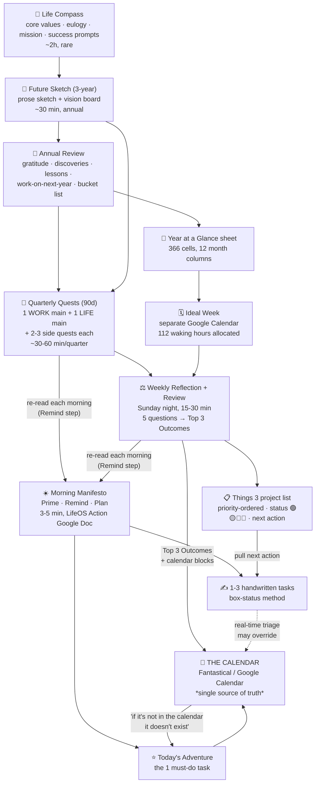

# Ali Abdaal — Operating Cadence & System Architecture (LifeOS / Notion / PARA)

Research date: 2026-08-09. Focus: the recurring loops that connect long-term direction to daily action, and the tooling underneath.

**Method note.** Every claim below is tagged `[VERIFIED]` (traceable to a primary Ali Abdaal source — his video transcript, his newsletter, his sales page) or `[INFERRED]` (my synthesis, or a third-party report). Each finding carries a **year**, because his system has churned heavily: Evernote → Notion → Roam → Apple Notes → Google Docs + Things 3. Where the current state contradicts an older video, I say so.

> ⚠️ Correction worth flagging: the top YouTube search hit for "How I Organize My Life | Notion Tour 2026" (`_RTqbo5ZZ2k`) is **Jeff Su, not Ali Abdaal**. Several third-party "Ali's Notion setup" articles appear to conflate creators. I discarded it.

---

## 1. Overview

### 1.1 The one-sentence architecture

Ali's system is **two pillars — Vision and Action — connected by four nested review loops** (annual → quarterly → weekly → daily), all of which converge on a single enforcement surface: **the calendar**.

> "If something is not on the calendar it basically doesn't exist." — *My Complete Productivity System*, Mar 2022 `[VERIFIED]`

> "The secret to truly enjoyable, meaningful and sustainable productivity … comes down to connecting two basic things: 1️⃣ VISION … 2️⃣ ACTION." — LifeOS sales page, 2025/26 `[VERIFIED]`

### 1.2 The single most important structural finding

**His personal system has no relational data model.** There is no database where a Task has a `Goal` relation which has a `Quarter` relation. The nesting is **procedural, not relational** — the levels are connected by *rituals that re-read the level above*, not by foreign keys.

- The Morning Manifesto's `Remind` step is literally a human `JOIN` — it makes you re-read your quarterly quests and weekly outcomes before you pick today's task. `[VERIFIED]`
- The weekly review's job is to re-sort the project list by priority and refresh each project's status. `[VERIFIED]`
- The only *object* that persists across all levels is a **calendar block**. `[VERIFIED]`

This matters a lot if you're modelling his system in software: the Notion/PARA relational stuff belongs to his **second brain (knowledge)**, not to his **operating cadence (execution)**. They are two separate systems that he has never fully merged. `[INFERRED — strongly supported; see §5.4]`

### 1.3 Current stack (as of the most recent primary evidence)

| Function | Tool | Evidence date |
|---|---|---|
| Daily planning doc | **"LifeOS Action" Google Doc** (Morning Manifesto) | Feb 2025 `[VERIFIED]` |
| Daily task shortlist | **Pen & paper** (handwritten, max 3 items, box-status method) | Feb 2025 `[VERIFIED]` |
| Task/project manager | **Things 3** | Feb 2025 `[VERIFIED]` |
| Calendar | **Fantastical** (front-end onto Google Calendar) | 2022–2023 `[VERIFIED]`; still calendar-first in 2026 `[VERIFIED]` |
| Annual macro view | **"Year at a Glance" Google Sheet** | Apr 2023 `[VERIFIED]` |
| Ideal week | A **separate Google Calendar** named e.g. "Ali's ideal week" | Apr 2023 `[VERIFIED]` |
| Time budget | **"168 Hours" Google Sheet** (free download) | 2026 `[VERIFIED]` |
| Journaling | **Day One** (AM5 / PM5 templates) | since 2016; templates ~late 2023 `[VERIFIED]` |
| Habit streaks | **Streaks** iOS app (home-screen widget) + **Whoop** for sleep | ~late 2023 / Feb 2026 `[VERIFIED]` |
| Team ops / knowledge | **Notion** (content production engine, wiki) | 2022–2026 `[VERIFIED]` |
| Capture (highlights) | **Readwise** ← Kindle, Instapaper, podcasts → Notion/Roam | 2022 `[VERIFIED]` |
| Files | **Google Drive** | 2022 `[VERIFIED]` |
| Email | **Superhuman**, "one-touch to inbox zero" (Tiago Forte method) | 2022 `[VERIFIED]` |
| Focus tracking | **Focus log / focus minutes** | 2025 `[VERIFIED]` |

**Conflict to flag:** aggregator sites (e.g. toolfinder.com/stacks/ali-abdaal) still list **Todoist** as his personal task manager. That was true in 2022 (`My Complete Productivity System`), but in Feb 2025 he says on camera "I use a to-do list manager called Things 3". Treat Todoist as **superseded**. `[VERIFIED conflict]`

---

## 2. Cadence loops

### 2.1 DAILY — the "Morning Manifesto" (current, Feb 2025)

**When:** first thing, before anything else. **Duration:** "3 to 5 minute journaling little prompt thing". **Artefact:** "it is in my LifeOS Action Google Doc". `[VERIFIED]`

Three named components — **Prime, Remind, Plan** — with these prompts (transcribed verbatim from *How I Manage My Time – The Triage System*, 18 Feb 2025; minor auto-caption artefacts noted):

**Prime**
> "let's connect to [our] body and prime our day with gratitude"

**Remind** — *this is the mechanism that links the day to the quarter*
> "let's remind ourselves of our key priorities — so what were our **quarterly quests** and how are they going"
> "what were our **top three outcomes for the week** and how are they going"

**Plan**
> "what is **today's adventure**, i.e. single most important task, going to be — **and is it in the calendar?**"
> "if we have time, what other **one to three tasks** will we complete today? Are those written down somewhere easily accessible, for example an index card or the today view of our to-do list app?"

Then, physically:
> "I take a fresh sheet on my little journal type thing and I write down physically by hand what specific tasks I want to get done today, and I try and limit myself to just three things." `[VERIFIED]`

#### The earlier version: AM5 / PM5 (Day One, ~late 2023) `[VERIFIED]`
A "5-minute morning journal" template in Day One, built by habit-stacking onto the adventure question:
1. "What's today's exercise plan?"
2. "**Is it in the calendar?**"
3. "What's today's adventure going to be?"

And an evening counterpart, **PM5**:
> "How did the diet and exercise go today? Any learnings for tomorrow?"
> — with the honest admission: "I've yet to build the habit of evening journaling into my life fully." `[VERIFIED]`

**Finding: there is no reliable evening/shutdown loop.** Across 2019–2026 primary sources I found exactly one evening ritual (PM5) and he says he doesn't do it. `[VERIFIED absence]`

#### Daily Highlight — the Make Time lineage
- He explicitly credits *Make Time* (Jake Knapp & John Zeratsky) as the source of the daily-highlight idea. `[VERIFIED]`
- Terminology has drifted: **"daily highlight"** (2019–2022) → **"today's adventure"** (2023–2025) → also **"daily quest"** (2023). Same object: the single must-do task of the day.
- The non-negotiable rule attached to it:
  > "I always time block my daily highlight (like 'call Grandma' or 'record video'). That way the 1 thing I've decided is super important is always going to get done." — X/Twitter, Apr 2021 `[VERIFIED]`
- In *How to Build Your Ultimate Productivity System* (2022) he calls the rest of the list a **"might-do list"**, deliberately: "it just takes a little bit of the pressure off me". `[VERIFIED]`

#### Daily Quests (Apr 2023, from CEO coach Eric Partaker) `[VERIFIED]`
Three daily quests, one in each of three domains — **work, health, relationships**. Coach's own term was "daily number ones"; Ali renamed them "quests" ("terminology from World of Warcraft"). Team ran a Slack accountability group for them. This 3-domain split is the same skeleton as the Wheel of Life (§2.3).

#### Overflow handling — this is unusually well specified
Ali's overflow doctrine has three named parts, all from the medical-triage framing (Feb 2025):

1. **Daily reset.** Every day starts on "a fresh piece of paper", not on yesterday's residue. Modelled on hospital doctors shredding their paper task list at end of shift. The master list still exists (Things 3) so nothing is lost; the *daily* surface resets. `[VERIFIED]`
2. **Real-time triage.** "Just because you wrote things down in a particular order doesn't mean that is the order they should be done." The morning plan is expendable the moment something more important arrives. `[VERIFIED]`
3. **Intentional incompletion.** Explicitly permitted un-doneness: "no one is going to die because you've taken a lunch break… the waiting room will always be full." He generalises Oliver Burkeman: "we're going to have to embrace mediocrity and embrace imperfection in quite a lot of the different areas of our life." `[VERIFIED]`

#### Task status notation — the "handwritten box method" `[VERIFIED, Feb 2025]`
Not a tick-box. A **four-state fill**, learned from hospital doctors, still in use:

| Mark | Meaning |
|---|---|
| `☐` | Not started |
| `◪` (diagonal line) | Started / requested |
| `◧` (half-shaded) | ~50% done |
| `■` then crossed out | Done and handed off / out of my hands |

Rationale he gives: you get "that little dopamine hit of being able to move that status of that task forward even if you haven't fully completed it just yet."

#### The 2-for-1 hour rule `[VERIFIED, Feb 2025]`
> "An hour before 9 is worth two after 5."
Anything creative and important gets scheduled **before** the workday, never after.

---

### 2.2 WEEKLY — two overlapping loops

Ali runs **two distinct weekly things** that are easy to conflate. Keep them separate:

#### (A) The Weekly Reflection — reflective, Sunday night, 15–30 min

**When:** "Every Sunday night". **Duration:** "15–30 minutes". `[VERIFIED — Instagram, @aliabdaal, post DCcGkj7oisR, Nov 2024]`
> "🚀 The Weekly Reflection: The Most Powerful Method I've Found to Stick to My Goals. Every Sunday night, I spend 15-30 minutes reflecting on the week."

In Feb 2026 he restates the duration as ~20 minutes:
> "I try my best to do a weekly review or reflection and this is just a series of questions that I ask myself. It takes about 20 minutes." `[VERIFIED]`

**The five questions.** Reported by an attendee of Ali's own *Weekly Review Workshop* (Feb 2024), instructed at **3 minutes per question** (≈15 min total). `[VERIFIED via third-party attendee — neurohackingly.com; consistent with his own prompts elsewhere]`

1. 🥅 **"What are your top 3-5 goals of the year?"**
2. 🎉 **"Review the previous week's accomplishments."**
3. 🏔️ **"What were last week's challenges? In what way did you not act in line with your best self? What would you like to change (if anything) next week?"**
4. 🗓️ **"Create calendar blocks for things you want to get done or things you want to take time for."**
5. 🚀 **"Choose your Top 3 outcomes for the upcoming week — if the week ahead was great, what would be the top 3 things you'd accomplish?"** → *"a. Schedule time in your calendar to work towards these outcomes."*

Note the shape: **two of five questions are calendar-writing actions, not reflection.** The review isn't allowed to end in prose; it ends in blocks.
Cross-check: the Morning Manifesto's `Remind` step asks "what were our **top three outcomes for the week**" — i.e. output of Q5 becomes input to every subsequent morning. `[VERIFIED — the loop closes]`

Workshop staging he recommends: pen & paper or a fresh Google Doc, background music, a hot drink, a 3-minute timer. `[VERIFIED via attendee]`

#### (B) The Weekly Review — operational, "ward round protocol"

Separately, he does a **project-hygiene pass** on his Things 3 project list. Verbatim (Feb 2025, said while doing it that morning):

> "actually these are my weekly review questions every week … part of Plan is: have we updated our to-do and project list so that
> — **quests and projects are arranged in priority order**,
> — **every project has a clear next action**, and
> — **every project has an up-to-date status**: on track / off track with a plan / off track without a plan / and on ice." `[VERIFIED]`

**Project status enum (emoji-coded in Things 3):** `[VERIFIED]`

| Colour | Status |
|---|---|
| 🟢 Green | On track |
| 🟡 Yellow | Off track **with a plan** |
| 🔴 Red | Off track **without a plan** |
| 🔵 Blue | On ice (deliberately stalled) |

"Next action" is a hard requirement, borrowed from both GTD and hospital ward rounds:
> "'continue' is not allowed to be a plan… every project has a clear next action." Legitimate next actions include `WF` = "waiting for" (e.g. "WF: TSJ our accounting firm"). `[VERIFIED]`

He is explicit that these two habits are the differentiators:
> "almost no one has a status for each of their projects and almost no one reliably has a clear next action step for each of their projects." `[VERIFIED]`

#### (C) Course name for the weekly loop: "Balanced Weeks" / "Balanced Week Blueprint"
- LifeOS module 6 is **⚖️ Balanced Weeks**: "create a personalised weekly rhythm that accommodates both your professional ambitions and personal priorities". `[VERIFIED — sales page]`
- In Feb 2026 he calls it "a weekly process of like prioritization and reflection that I call the **balanced week blueprint**". `[VERIFIED]`
- Framing from a course participant: "It's not about having a *perfect* week. It's about making a *balanced* week." Weekly ritual = review 90-day goals → reflect on last week's wins & challenges → set three priorities for the coming week (~30 min, or as little as 5). `[VERIFIED via third-party participant, Feb 2025]`
- LifeOS FAQ states the intended time commitment: "**30–60 minutes weekly** for planning and reflection" (plus 2–3 hours initial setup). `[VERIFIED — sales page]`

#### The historical (2020) weekly review — for contrast
His first documented weekly review, from *LifeNotes*, "The Power of the Weekly Review" (≈Oct 2020). Discovered via David Allen's *GTD* in 2018; admits "I've only actually done the Weekly Review a handful of times in the past 2 years." `[VERIFIED]`

> 1. List the dates from the past week.
> 2. For each date, I look through (a) my calendar, and (b) my Daily Note on Roam.
> 3. I note down the salient things that happened on the day. It might be projects or tasks I finished, people I talked to, books that I read — basically anything that I think 'oh yeah that's important'.
> 4. As I'm doing this, I'll think of other related [things] that I need to do / delegate, and so I add those to my todo list.

And, candidly: "The next step would be to build some sort of reflective practise into my Weekly Review… I'm deliberately keeping it simple for now." The 2024 five-question version is the fulfilment of that promise. `[VERIFIED]`

---

### 2.3 MONTHLY — essentially absent

**I could not find a monthly review in Ali's personal cadence.** `[VERIFIED absence, with caveats]`

- No monthly loop appears in the Trident method (annual / weekly / daily), the LifeOS module list (Life Compass / Future Sketch / Quarterly Quests / Focus Hours / Productive Days / Balanced Weeks), or the Feb 2026 systems video (life compass → 3-year sketch → quarterly quests → balanced week blueprint).
- The single monthly thing he *does* name is a **relationship review**: "doing something like regular relationship reviews, maybe once a month where you and the spouse … sit down and actually reflect on the state of your relationship and if there's any minor grievances." (Feb 2026) `[VERIFIED]`
- Also monthly-ish social rituals: monthly book club, monthly movie night, one-on-one lunch with each team member "once every couple of months". `[VERIFIED]`
- A "Monthly review" thread exists in his Productivity Lab community, but it is login-gated and is community discussion, not necessarily his own practice. `[UNVERIFIED — gated]`
- Passing mention in Apr 2023: "on the level of annual … weekly and monthly … and daily I just follow the intention I've already set" — the only time he lists monthly as a level, and he never elaborates. `[VERIFIED but thin]`

**Conclusion:** his ladder is **annual → quarterly → weekly → daily**, with month as a display granularity (the Year-at-a-Glance sheet hides past month columns) rather than a review cadence. `[INFERRED, well-supported]`

---

### 2.4 QUARTERLY — "Quarterly Quests" (the load-bearing loop)

**Duration:** "maybe **half an hour every quarter** to define quarterly quests" (Feb 2026) `[VERIFIED]`; a third-party course participant says "only **one hour** of planning for three months of focused action" `[VERIFIED via participant]`.
**Format:** he hosts a free public **Quarterly Alignment Workshop** on Zoom every ~3 months (~3,000 live attendees in the Jun 2024 session), with a free Google Doc template. `[VERIFIED]`

#### Origin
From *The 12 Week Year* (Brian Moran & Michael Lennington) — "the whole book is about quarterly planning; it's about thinking of a year instead of it being 52 weeks, instead thinking of a year as being 12 weeks." Motivating mechanisms he cites: **the execution gap**, **periodization** (from 1970s Eastern-European Olympic training), and **the deadline effect** / Parkinson's law. `[VERIFIED, Apr 2024]`

#### The quest object — exact structure
Two mandatory quests per quarter: **one Work Main Quest, one Life Main Quest.** Plus "two or three side quests" each, explicitly nice-to-have. `[VERIFIED, Jan 2025]`

**Verbatim template (the closest thing he has to a schema):**
> My [work/life] main quest is to **_____**.
> This is the single most important thing for me to accomplish in the next 90 days because **_____**.
> To complete the quest, I commit that in the next 90 days I will have **_____** *(objective, verifiable criteria that someone else can verify)*.
> This feels really exciting and compelling for me because **_____** *(lean into the emotions)*.
> To make sure I complete the quest, I am going to **_____**.

Field-by-field, that is: `title` · `why_it_matters` · `verifiable_completion_criteria[]` · `emotional_resonance` · `execution_commitments[]`. `[VERIFIED]`

**Selection prompts (work):** `[VERIFIED, verbatim]`
- "What one thing, if accomplished, would move the needle the absolute most?"
- "If you fast forward 3 months, what is the one accomplishment that would make you most proud?"
- "What's the one thing that would make everything else easier or unnecessary?"
- "What is the one thing you've been postponing but know it would be transformative if you tackled it?"
- "If I spent the first 2 hours of my workday purely focused on X, it would have an enormous impact on my work — what is X?"

**Selection prompts (life):** `[VERIFIED, verbatim]`
- "What is the one thing that if accomplished would bring the most joy, fulfilment or peace to your personal life?"
- "What is the one change that would positively impact every other area of your life?"
- "What's the one thing you've been avoiding but know it would have a transformative effect on your relationships or happiness?"
- "If I dedicated 1 hour of each day purely focused on X, it would have a profound impact on my life — what is X?"

**Anti-pattern he calls out by name:** "I commit that I will stop procrastinating" is rejected as not objectively verifiable; the fix is to convert it to a metric ("I will get my focused minutes to 180 minutes every workday, 80% of the time"). `[VERIFIED]`

**Real example of the weekly↔quarterly link, from his own quest:**
> "…thirdly, **check in with myself each week as part of my weekly review to make sure I've got a class scheduled for the following week**." `[VERIFIED]`
That single line is the cleanest statement of how quarter → week → calendar actually works in his system.

#### The quarterly reflection half
From "It's Time for Your Quarterly Reflection" (LifeNotes, ~Jun 2024) — the reflection agenda he actually walks through: **wins from the last 90 days (with a "why it's important" note on each)** → **challenges** → **a domain sweep including relationships** → **set next quarter's Quarterly Quests**. Closing prompt to readers: `[VERIFIED]`
> "What were your biggest wins from the last 90 days, and what are your Quarterly Quests for the next 90?"

#### The three-step quarterly method: Reflect → Align → Plan `[VERIFIED, Jan 2025]`

**Step 1 — Reflect (mini life audit).** Two tools:
- **Wheel of Life**, 3×3: **Work** (mission/business, money, growth) · **Health** (body, mind, heart) · **Relationships** (romantic, family, friends). Rate satisfaction **0–10** in each of the nine. Plus a **10th category, "Joy", drawn outside the wheel**, as a deliberate counterweight to growth-fixation.
- **What's working / what's not**, 2×2 grid (columns: Work, Life; rows: What's working, What's not working), 5-minute timer, background music. **Hard rule: the "what's working" cell must contain at least twice as many items as "what's not working."**

**Step 2 — Align.** The **Three-Year Sketch** (see §3).

**Step 3 — Plan.** The two Main Quests above.

---

### 2.5 ANNUAL

**Duration:** the components are individually costed in Feb 2026: `[VERIFIED]`
- Life Compass: "maybe a couple of hours"
- Three-year sketch / vision board: "maybe half an hour"

**Format:** a free public **Annual Planning Workshop** (e.g. 6 Jan 2024, 1400–1700 GMT — a 3-hour live Zoom), recorded, with worksheets and templates emailed after. `[VERIFIED]`

**Agenda (Dec 2023 newsletter describing the workshop method):** `[VERIFIED]`
1. **Reflect on the year** — structured reflection prompts, written down, kept year over year ("you can then look back on your Annual Planning documents every year").
2. **Find your North Star** — long-term direction, via journaling prompts. The operative test he gives: *"To what extent is what I'm currently doing aligned with this future that I think I want?"*
3. **Decide on next year's goals** — (a) **divergent** thinking to list many *dreams*, then (b) **convergent** thinking to narrow to specific *goals*.

**The 2019 Notion annual review template** (still the most concrete public artefact, `Ck5JOj4TlM4` + free Notion template) — five toggle sections: `[VERIFIED]`
1. **Stuff I'm grateful for** (sub-split: experiences · people · accomplishments · things)
2. **Stuff I discovered** (books, methods, tools)
3. **Life lessons** (in 2019, cross-linked to the 15 newsletter issues where he'd written each one up)
4. **Stuff to work on next year** (his 2019 buckets: Life · Medicine · Side hustles)
5. **Bucket list** — "at least like 50 things", explicitly "as unrealistic as you like"

He has done an annual review **every year since 2017** `[VERIFIED]`, and in 2019 explicitly *rejected* SMART goals — "I just don't really like the idea of having goals… I much prefer the idea of just kind of enjoying the process, having systems" — while noting "maybe I'll change my mind about goal-setting next year." `[VERIFIED]` He did: by 2024–26 the system is explicitly goal-driven (GPS, quests with verifiable criteria). This is the single biggest philosophical reversal in his cadence history.

**Also annual:** a **Year at a Glance** sheet built each January (§4), and — in Feb 2026 — the advice to block holidays/sabbaticals in the calendar *before* any business planning for the year. `[VERIFIED]`

---

## 3. The nesting: vision → annual → quarter → week → day

### 3.1 The layers, named

| Level | Ali's name | Cadence | Duration | Artefact |
|---|---|---|---|---|
| Values / purpose | **Life Compass** (🧭, "4-part framework"); earlier "North Star" | ~annual or rarer | ~2 hours | Journal / LifeOS doc |
| 3-year horizon | **Future Sketch** / **Three-Year Sketch** (🎨) | annual | ~30 min | Written sketch **and/or vision board** |
| Year | Annual review + next-year goals; **Year at a Glance** | annual (Dec/Jan) | 3h workshop | Notion page + Google Sheet |
| Quarter | **Quarterly Quests** (🚀) — 1 work + 1 life main quest, 2–3 side quests each | every 90 days | 30–60 min | Google Doc template |
| Week | **Balanced Weeks** (⚖️) / Weekly Reflection + Weekly Review | Sunday night | 15–30 min (up to 60) | Doc + Things 3 + calendar |
| Day | **Morning Manifesto** (Prime/Remind/Plan) → **Today's Adventure** + 1–3 tasks | every morning | 3–5 min | LifeOS Action Google Doc + paper |
| Container | **Ideal Week** | set once, revised occasionally | — | Dedicated Google Calendar |
| Execution | Time blocks | continuous | — | Fantastical / Google Calendar |

The Life Compass → Future Sketch → Quarterly Quests → Balanced Week chain is stated as a single sequence in Feb 2026: `[VERIFIED]`
> "my process starts with … vision, where there's like a life compass section where you figure out what you actually want your life to look like very long term and what are your core values. Then we turn it into a **3-year sketch** where you can use like a vision board … and then we make **quarterly quests** which are like 90-day goals. And then after we've figured out our quarterly quests, we have a weekly process of prioritization and reflection that I call the **balanced week blueprint**."

### 3.2 Data flow — what references what



### 3.3 The explicit reference edges (what "points at" what)

| Edge | Mechanism | Evidence |
|---|---|---|
| Quarter → Day | Morning Manifesto `Remind`: "what were our quarterly quests and how are they going" | Feb 2025 `[VERIFIED]` |
| Week → Day | Morning Manifesto `Remind`: "what were our top three outcomes for the week and how are they going" | Feb 2025 `[VERIFIED]` |
| Quarter → Week | Quest commitment field literally names the weekly review: "check in with myself each week as part of my weekly review to make sure I've got a class scheduled" | Jan 2025 `[VERIFIED]` |
| Year → Week | Weekly review Q1: "What are your top 3-5 goals of the year?" — the year is re-read weekly | Feb 2024 `[VERIFIED]` |
| Week → Calendar | Weekly review Q4 & Q5a are *write* actions: create blocks / schedule time for the Top 3 Outcomes | Feb 2024 `[VERIFIED]` |
| Day → Calendar | "…and **is it in the calendar?**" — the adventure isn't planned until it's blocked | 2023–2025 `[VERIFIED]` |
| Ideal Week → Real Week | "on the weekend before I will look forward at my calendar for the upcoming week and I will create blocks of time" using the ideal week as the default template | Apr 2023 `[VERIFIED]` |
| Year → Ideal Week | Year at a Glance surfaces travel/retreats/holidays; those override the ideal week and get reflected into the real Google Calendar "so the team knows exactly what's going on" | Apr 2023 `[VERIFIED]` |
| Project → Task | Weekly review enforces "every project has a clear next action"; that next action is what becomes a daily task | Feb 2025 `[VERIFIED]` |

**The missing edge.** There is **no verified mechanism linking an individual task record back to a goal record** — no `task.goal_id`. Tasks connect to goals only through (a) the human re-read in `Remind`, and (b) the priority ordering of the project list during the weekly review. `[VERIFIED absence in his personal system]`

### 3.4 The domain taxonomy (used at every level, with drift)

He has three near-identical 3-domain splits, which is the closest thing he has to a stable "life areas" enum:

| Context | Domains | Year |
|---|---|---|
| Daily Quests | Work · Health · Relationships | 2023 |
| Wheel of Life (top level) | Work · Health · Relationships (+ Joy outside) | 2025 |
| Wheel of Life (sub-level) | Work: mission/money/growth · Health: body/mind/heart · Relationships: romantic/family/friends | 2025 |
| Quarterly Quests | **Work · Life** (only two) | 2024–2026 |
| Third-party weekly-review adaptation | Health · Wealth · Relationships | 2024 |

`[VERIFIED]` Note the quest layer collapses to **two** domains, not three — a deliberate simplification.

---

## 4. Time-management substrate: the "Trident" method (Apr 2023)

Three levels of calendar, taught as one system. Free templates were published in the video description. `[VERIFIED]`

### 4.1 Year at a Glance (Google Sheet)
- Origin: the bullet-journal "year at a glance" spread; he bullet-journalled for the last 4 months of 2022, then rebuilt this one view digitally in Jan 2023 ("a spreadsheet just does the job totally fine").
- Structure: **12 month columns × dates 1–31 down the side = ~366 cells.** Months colour-coded; weekends colour-coded.
- Use: (1) bird's-eye planning of trips/retreats/holidays; (2) after planning there, "I then reflect those changes in my actual Google Calendar so the team knows exactly what's going on".
- Maintenance: right-click → hide the columns for months that have passed.

### 4.2 Ideal Week (a *separate* Google Calendar)
- Origin: his CEO coach **Eric Partaker**, who runs it with all his clients; Ali had been using it ~8 months by Apr 2023.
- Method: create a brand-new empty calendar (e.g. "Ali's ideal week"), then allocate the **112 waking hours** (168 − 56 sleep) into recurring "containers".
- Blocks he places: wake 07:00 + 1h morning routine (daily, yellow, emoji) · wind-down 22:00, asleep 23:00 (daily, lavender) · breakfast+journaling 08:00–09:00 · workday from 09:00 · deep-work writing blocks · filming blocks · gym blocks · recurring team meetings · lunch/dinner · **date night (Thursday, and a mini one Monday)** · Tuesday evening social dinner (default-free slot) · Wednesday dinner with mum & grandma · weekends left free.
- Doctrine: containers are *defaults*, not commitments — "I'm not fully wedded to them". And the diagnostic value is the point: it reveals whether you actually have room for the guitar lesson, converting *"I don't have the time"* into *"I'm choosing not to make the time."*

### 4.3 Day: follow the calendar
> "on the level of day planning … I would literally just follow whatever I have planned." Plus the three Daily Quests, each of which must be dragged onto the calendar (Fantastical lets you drag a task straight onto a time slot).

### 4.4 168 Hours spreadsheet (2026)
A newer free Google Sheet: enter minutes/hours for sleep, wind-down, work, commute, getting ready, breakfast/lunch/dinner (eating + prep), groceries, cleaning, laundry, misc chores, childcare, fitness — it computes the weekly total and the residual "everything else". Companion to the ideal week; it makes the budget explicit before you allocate it. `[VERIFIED]`

---

## 5. LifeOS / Notion architecture

### 5.1 What "LifeOS" means — three different things, don't conflate them

| Sense | What it is | Era |
|---|---|---|
| **LifeOS (1) — the Notion notebook** | A personal Notion page he jokingly called "my LifeOS kind of notebook… I like to use Notion as the operating system for my life". Contained: daily highlights · some weekly reviews · annual reviews. | 2019–~2021 `[VERIFIED]` |
| **LifeOS (2) — the Google Doc** | "my LifeOS **Action** Google doc" — where the Morning Manifesto lives. Note the word *Action*, implying a sibling *Vision* doc. | 2025 `[VERIFIED]` |
| **LifeOS (3) — the course** | A $297 self-paced course, 7 modules, 2 pillars, 3,000+ students, ships with "a full LifeOS Notion template". | 2025–2026 `[VERIFIED]` |

### 5.2 LifeOS the course — the canonical module schema `[VERIFIED, sales page 2025/26]`

```
LifeOS
├── Pillar 1: VISION  — "Gain Clarity, Get Direction & Set Your Goals"
│   ├── 🧭 Life Compass      — "transformative 4-part framework"; align daily actions with deepest values
│   ├── 🎨 Future Sketch     — "flexible 3-year roadmap"
│   └── 🚀 Quarterly Quests  — "the GPS Method"; 12-week sprints + milestone tracking
└── Pillar 2: ACTION  — "Take Action, Get Organised & Manage Your Time"
    ├── ⏳ Focus Hours       — distraction-free deep work periods
    ├── ☀️ Productive Days   — "bridges the gap between your long-term vision and daily execution"
    └── ⚖️ Balanced Weeks    — "personalised weekly rhythm"
```

Stated properties: **"It's app-agnostic — LifeOS works with whatever tools and platforms you prefer."** Setup 2–3 hours; ongoing 30–60 min/week. 30-day money-back guarantee. `[VERIFIED]`

Lineage: **Productivity Lab** (launched Jan 2024, a 12-week cohort program, taught partly by Kaylen Apple, covered sleep/nutrition/burnout/mindset/workspace) → trimmed and refocused into **LifeOS** (7 modules, all taught by Ali, "regeneration module thoughtfully removed"). `[VERIFIED via third-party cohort participant, Feb 2025]`

### 5.3 The GPS method (the goal-setting sub-schema)

**G**oal → **P**lan → **S**ystem. `[VERIFIED — Ali's own TikTok/@aliabdaal and Feb 2026 video]`
- **Goal** — what do I want to achieve, and why? (measurable outcome + intrinsic motivation)
- **Plan** — the 3–5 major milestones that show progress; is it realistic given how I've actually behaved before?
- **System** — the daily/weekly actions that make it happen.

He also ships a **"GPS Coach GPT"** at aliabdaal.com/gps-coach. `[VERIFIED — page exists; content gated]`

The GPS layer is what sits *inside* a Quarterly Quest: quest title/why = **G**, verifiable criteria = **P**, execution commitments = **S**. `[INFERRED — the field mapping is exact but he never states it explicitly]`

### 5.4 PARA — what he actually uses

**Ali did not invent and does not schematise PARA.** He is a downstream adopter of Tiago Forte's *Building a Second Brain*.

- **Mar 2019, LifeNotes "Building a Second Brain":** he reads Forte's overview, is sold, "switched all my note-taking and writing over to Notion", and in the same issue links Forte's *The PARA Method* article: "I've taken **many ideas away from it for how to organise my own digital life**." `[VERIFIED]` — note the hedge; he never says "I use PARA."
- **Jul 2022:** BASB is the top of his three-layer model (the "Dumbledore layer" — "making connections… using our productivity system for creativity rather than just for storage"). He says he'd been using it since mid-2019. `[VERIFIED]`
- **Nowhere in the primary sources I reviewed does he lay out Projects / Areas / Resources / Archives as *his own* Notion schema with fields and relations.** `[VERIFIED absence]`

**Therefore: do not attribute a "Projects vs Areas vs Goals" schema to Ali.** That structure belongs to Forte (and to third-party template sellers, and to Jeff Su's "Areas / Area Pillars" command centre which is frequently mis-attributed to Ali). If you need Ali's own equivalents:

| Concept | Ali's actual object | Where it lives |
|---|---|---|
| Goal (long horizon) | Life Compass / Future Sketch | Journal / doc |
| Goal (90-day) | **Quarterly Quest** (main + side) | Google Doc; mirrored as top item in Things 3 |
| Project | **Things 3 project**, with `status` + `next action`, priority-ordered | Things 3 |
| Area | *No formal Area object.* The nearest thing is the 3-domain split (Work/Health/Relationships) used in the Wheel of Life and Daily Quests | Conceptual only |
| Resource | Readwise → Notion/Roam; Instapaper; Apple Notes; Resonance Calendar | Notion / Roam / Apple Notes |
| Archive | *Not documented* | — |

### 5.5 The Roam era (2020–~2022) — the most schema-like thing he ever published

Roam Research, ~4 months in by Jul 2020, ~$500 "Believer" plan. Two features he built on: **Daily Note** and **bi-directional linking**. `[VERIFIED]`

**Daily Note template (triggered by an Alfred snippet `roamdaily`)** — six "C" sections: `[VERIFIED]`

| Section | Contents |
|---|---|
| **Create** | what he made that day (linked to the relevant page, e.g. `[[video roam intro]]`) |
| **Connect** | people spoken to; standing prompt: *"message someone I haven't spoken to in a while"*; recurring to-do `call Nani` (grandma) |
| **Consume** | links to books/podcasts/articles consumed |
| **Cerebrate** | thinking — new **evergreen notes** created |
| **Coordinate** | calendar items / meeting notes |
| **Consolidate** | health & life admin (e.g. workout to-do) |

Pinned above it, a "daily reminder" derived from *The Top Five Regrets of the Dying* (via Paul Graham): *"don't ignore your dreams · don't work too much · say what you think · cultivate friendships · be happy."* `[VERIFIED]`

**The capture pipeline — the "Nibble" framework** `[VERIFIED]`
- Every consumed item is tagged `#nibble` on capture → it appears in a Roam query view called **"nibbles awaiting digestion"** (i.e. a content inbox; he says the honest name is "content inbox" but "nibble sounds more playful").
- Once its insights have been rewritten in his own words as **evergreen notes**, it also gets `#digested` → and drops out of the queue.
- Explicit design intent: this fixed the flaw in his older **Resonance Calendar** (Notion) — "there was just no real process to encourage me to actually take notes about it and actually mine the insights from it."
- Evergreen notes are tagged (`#evergreen`, `#life`, `#meaning`, `#happiness`) and collected under a hub page called **"Trees of Knowledge"**.
- Book note pages carry a `recommended by [[person]]` field and `started [[date]]` / `finished [[date]]` links, plus `#TBR` for to-be-read.

**This is genuinely the only place Ali documents an inbox-with-a-state-machine.** By 2022 he'd largely abandoned it ("I've just found over time that simple is just better for me… I find myself using Apple Notes for most of my note-taking needs"). `[VERIFIED]`

### 5.6 Notion's actual current role

- **Team ops, not personal execution.** "Notion is the app that we use for all of our projects across the whole team"; the flagship object is the **Content Production Engine** database tracking every video across the main channel, second channel, third channel and the Deep Dive podcast, with **per-person personalised views** ("they can just hit a single page and they can see exactly what they're supposed to be working on in terms of research or thumbnails"). `[VERIFIED, 2022]`
- **Personal daily tasks deliberately *not* in Notion.** He is repeatedly explicit that a lightweight list app beats a Notion database for daily capture. `[VERIFIED]`
- His public Notion templates are narrow, not a LifeOS: **Annual Review template**, **Resonance Calendar**, **Book Notes**, plus student/YouTube templates. `[VERIFIED]`
- LifeOS the course ships a Notion template "to track everything from your life vision to your focus hours" — but its field-level schema is **paywalled and I could not verify it**. `[UNVERIFIED — gated]`

---

## 6. Dashboards — what he actually looks at

| Dashboard | Surfaces | Cadence | Year |
|---|---|---|---|
| **Fantastical day/week view** | Literally the day's instructions. "I look at my calendar multiple times a day because my calendar tells me literally what I'm doing." | continuous | 2022–26 `[VERIFIED]` |
| **Things 3 project list** | All work + life projects, **priority-ordered**, each with 🟢🟡🔴🔵 status and a next action; the two Main Quests sit at the top | reviewed weekly, glanced daily | 2025 `[VERIFIED]` |
| **Year at a Glance sheet** | Whole year on one screen; past months hidden | monthly-ish glance, annual build | 2023 `[VERIFIED]` |
| **Ideal Week calendar** | The default template week, toggled on/off as an overlay | when planning next week | 2023 `[VERIFIED]` |
| **Streaks widget on iPhone home screen** | Which habits are ticked today — deliberately the *first thing he sees* when unlocking the phone | continuous | ~2023 `[VERIFIED]` |
| **Whoop** | Sleep score; 380-day streak as of Feb 2026 | daily | 2026 `[VERIFIED]` |
| **Rise.io** | Automatic time tracking — "last week allegedly I worked for 36 hours, of which 8 hours was on Zoom, 4 hours documenting, 4 hours in-person meeting, 3 hours writing" | weekly glance | 2022 `[VERIFIED]` |
| **Focus log / focus minutes** | Minutes of focused work per day; used as a verifiable quest criterion | daily | 2025 `[VERIFIED]` |
| **Notion Content Production Engine** | Every video's stage; per-person filtered views | team, continuous | 2022 `[VERIFIED]` |
| **168 Hours sheet** | % of the week going to sleep / work / food / chores / everything else | one-off audit | 2026 `[VERIFIED]` |

---

## 7. Capture, inbox, and how tasks reach goals

### 7.1 Capture

- **Task capture:** to-do app is in the iPhone dock, first row. "Anytime a task pops into my mind I think 'okay this is not gonna happen until I write it down' and I just open up [the app] and write down whatever the task is." (Todoist 2022 → Things 3 2025) `[VERIFIED]`
- **100% coverage rule** — his stated failure mode: "if you have a to-do list and it only covers 90% of your things… I can't remember what I've forgotten," which produces permanent low-grade stress. `[VERIFIED]`
- **Someday/Maybe list** (GTD): a live list of would-like-to-do things ("rollerblading, archery, hunting, glamping, mountain biking, wakeboarding"), consulted when planning holidays. `[VERIFIED]`
- **Highlight capture (automatic):** Readwise syncs Kindle + Instapaper + iBooks + podcast highlights → exports to Notion/Roam. Daily email of 5 random resurfaced highlights. `[VERIFIED]`
- **Read-it-later:** Instapaper, with a Gmail forwarding rule that sends newsletters straight into it. `[VERIFIED]`
- **Manual capture:** Apple Notes (audiobook notes, podcast notes, book-research folders); Day One for journaling. `[VERIFIED]`
- **Delegation:** a shared Todoist project named for his assistant — "I can just make a little project called Dan, share it with him." `[VERIFIED, 2022]`

### 7.2 Inbox handling

- **Email:** Tiago Forte's **"one touch to inbox zero"** — every email touches the inbox once and is routed to exactly one of: calendar / task manager / notes app / read-it-later, then archived. Plus a Gmail filter that auto-skips the inbox for anything containing the word "unsubscribe". `[VERIFIED, 2022]`
- **Messages:** Texts.com aggregating WhatsApp/iMessage/Twitter DMs/Telegram — batched, and he freely admits to "dozens if not potentially 100 unread messages". `[VERIFIED, 2022]`
- **Team inbox (Todoist template he published):** three projects only — **Team Inbox** (collect, sectioned) → routed to **Questions/Approvals** or **Tasks**; task comments are the source of truth for async detail; "a quick review of these projects daily". `[VERIFIED]`

### 7.3 How a task links back to a goal — honest answer

There is **no automated link**. The chain is enforced by four human checkpoints:

1. **Quarterly:** the quest's *execution commitments* field names concrete recurring behaviours (e.g. "schedule the first 2 hours of each workday to work on it until it's done"; "log my focus time"; "send daily progress updates to the team").
2. **Weekly:** projects are re-sorted into priority order, so the quest's project is physically at the top of the list; each gets a status and a next action.
3. **Daily (`Remind`):** the quests and the week's Top 3 Outcomes are re-read before the day is planned.
4. **Calendar:** the adventure must be blocked; the daily quest must be dragged onto the calendar.

`[VERIFIED for all four]` — and this, not a schema, is the actual mechanism.

---

## 8. Habit tracking & streaks

- **Streaks (iOS)** — "a super simple habit tracker… I've got a widget on my iPhone's home screen. The widget shows you which of your habits you've 'ticked off' today and which you haven't." Placement is the whole point: "the first thing I see on my phone when I open it is therefore a reminder of 'oh yeah I need to do my 30 minutes of exercise today'." `[VERIFIED, ~late 2023]`
- **Whoop** — sleep score, 380-day wear streak (Feb 2026). Generalised principle: "having some sort of metric that you can look at to see how effective your system is performing, and then being able to adjust your system based on the metric, is generally quite helpful. It's not absolutely essential, but for most things having some way to measure the number actually does genuinely help." `[VERIFIED]`
- **Focus minutes log** — his preferred "make it verifiable" metric; he claims "if the only change you made to your life was to consistently track your focus minutes, you'd probably double your productivity." `[VERIFIED via LifeOS cohort attendee quoting him, Jan 2025]`
- **Explicitly NOT a streak maximalist.** Habits are subordinate to systems in his taxonomy; *Feel-Good Productivity*'s pitch is precisely that habit-streak tactics are the wrong starting point and negative emotion is the real blocker. And his own tooling philosophy pushes against rigidity: "a system that forces you to conform to it very rigidly, at least for me, is not a system that will work out for me… I don't use it every day" (of the Part-Time Productivity Planner). `[VERIFIED]`
- **Habit-adjacent systems he does emphasise (Feb 2026):** sleep OS (fixed bed/wake time, 19 °C room, no phone in bedroom, Kindle on nightstand, morning sunlight), diet systematisation ("Chinese takeout Tuesdays", Sunday batch prep), exercise (3× weights, 3× zone-2, 1–2× yoga, 10k steps), relationship systems (weekly date night, monthly relationship review, standing social events, birthday reminders 2 weeks ahead), finance automation on payday. `[VERIFIED]`

---

## 9. Evolution over the years

| Year | What changed | Source |
|---|---|---|
| 2017 | First annual review (Evernote) | `[VERIFIED]` |
| Mar 2019 | Reads Tiago Forte's *Building a Second Brain* + *PARA Method*; **moves all note-taking to Notion** | LifeNotes `[VERIFIED]` |
| Dec 2019 | "LifeOS notebook" in Notion holds daily highlights, weekly reviews, annual reviews. Publishes free **Annual Review Notion template**. **Explicitly rejects SMART goals**, prefers "systems over goals" | `Ck5JOj4TlM4` `[VERIFIED]` |
| 2020 (Mar–) | **Roam Research era**: Daily Note + bi-directional links; 6-C daily template; nibble/digested pipeline; evergreen notes; Trees of Knowledge | `bpikCLhpIRY` `[VERIFIED]` |
| Oct 2020 | First documented Weekly Review — 4 steps, calendar + Roam Daily Note. Admits he'd only done it "a handful of times in the past 2 years" | LifeNotes `[VERIFIED]` |
| Mar 2022 | **Complete Productivity System** = 6 app modules (Coordinate/Communicate/Consume/Capture/Create/Misc). Fantastical + Todoist + Notion (team) + Google Drive. Roam being displaced by Apple Notes | `tQSKyvjsUuI` `[VERIFIED]` |
| Jul 2022 | Three-layer model: **Ron** (calendar, email, to-do, files) → **Hermione** (Kindle, Instapaper, Readwise, capture app) → **Dumbledore** (BASB) | `T6hmdrsLQj8` `[VERIFIED]` |
| Apr 2023 | **Trident Calendar System** — Year at a Glance + Ideal Week + Daily Quests. Introduces CEO coach **Eric Partaker**. First strong annual↔weekly↔daily structure | `6o2tm00Ar8A` `[VERIFIED]` |
| late 2023 | **Streaks** widget + **Day One AM5/PM5** templates | LifeNotes `[VERIFIED]` |
| Dec 2023 – Jan 2024 | *Feel-Good Productivity* launch; free 3-hour **Annual Planning Workshop**; Reflect → North Star → divergent/convergent goals | `[VERIFIED]` |
| Jan 2024 | **Productivity Lab** launches — 12-week cohort program | `[VERIFIED via participant]` |
| Feb 2024 | **Weekly Review Workshop** — the 5-question / 3-min-each format | `[VERIFIED via attendee]` |
| Apr 2024 | *The 12 Week Year* book club → **Quarterly Quests** rationale (periodization, deadline effect, execution gap) | `nIv1J5O15To` `[VERIFIED]` |
| Jun 2024 | Free **Quarterly Alignment Workshop** (~3,000 live) + free Google Doc template | LifeNotes `[VERIFIED]` |
| Jan 2025 | **90-day method** formalised: Reflect (Wheel of Life 3×3 + Joy; 2:1 working/not-working rule) → Align (3-year sketch / vision board) → Plan (1 main + 2–3 side quests, work & life). First vision board | `U7JNdMbj1zM` `[VERIFIED]` |
| Feb 2025 | **Triage System** video: **Morning Manifesto** (Prime/Remind/Plan) in the **LifeOS Action Google Doc**; **Things 3** replaces Todoist; ward-round protocol; 🟢🟡🔴🔵 statuses; box-status notation; 2-for-1 hour rule | `VpN78TXMSUM` `[VERIFIED]` |
| Feb 2025 | **LifeOS evergreen course** ships — 7 modules + full LifeOS Notion template; Productivity Lab trimmed into it | `[VERIFIED via participant]` |
| 2025–26 | LifeOS positioned as **2 pillars / 6 named modules**, $297, **app-agnostic**, 3,000+ students | sales page `[VERIFIED]` |
| Feb 2026 | **GPS method** front-and-centre; cadence stated end-to-end with durations (Life Compass ~2h → 3-Year Sketch ~30min → Quarterly Quests ~30min/quarter → **Balanced Week Blueprint** ~20min/week). Five recommended life systems: goal-setting, time management, health OS, relationships, finance automation | `MBPHU7aaklM` `[VERIFIED]` |
| 2026 | **168 Hours** free spreadsheet | `mAGVDDhujzc` `[VERIFIED]` |

**Three through-lines that never changed:**
1. Calendar-as-truth ("if it's not in the calendar it doesn't exist") — 2019 to 2026.
2. One most-important-thing per day (highlight → adventure → quest) — 2019 to 2026.
3. "Your brain is for having ideas, not storing them" (David Allen), invoked at every stage.

**Two big reversals:**
1. **Anti-goals → pro-goals.** 2019: "I just don't really like the idea of having goals." 2026: an entire course built on quests with objective verifiable criteria.
2. **Tool maximalism → app-agnosticism.** 2022: 30+ named apps in one video. 2026: LifeOS explicitly sold as "app-agnostic", the daily driver is a Google Doc and a sheet of paper.

---

## 10. Source list

**Ali Abdaal — video (YouTube; auto-captions retrieved and read in full)**
- *My Annual Review using Notion* (27 Dec 2019) — https://www.youtube.com/watch?v=Ck5JOj4TlM4
- *How I Organise My Life* [Roam Research walkthrough] (21 Jul 2020) — https://www.youtube.com/watch?v=bpikCLhpIRY
- *The Most PRODUCTIVE Thing I Do Each Year* (3 Jan 2021) — https://www.youtube.com/watch?v=ERGbgvvCJ8o
- *My Complete Productivity System* (25 Mar 2022) — https://www.youtube.com/watch?v=tQSKyvjsUuI
- *How to Build Your Ultimate Productivity System* (14 Jul 2022) — https://www.youtube.com/watch?v=T6hmdrsLQj8
- *How I Manage My Time – The System That Changed My Life* (19 Aug 2022) — https://www.youtube.com/watch?v=ombpvrlglfU
- *How I Manage My Time – The Trident Calendar System* (24 Apr 2023) — https://www.youtube.com/watch?v=6o2tm00Ar8A
- *How to Do More in 12 Weeks than Others Do in 12 Months* (16 Apr 2024) — https://www.youtube.com/watch?v=nIv1J5O15To
- *You're Not Behind: How to Change Your Life in 90 Days* (21 Jan 2025) — https://www.youtube.com/watch?v=U7JNdMbj1zM
- *How I Manage My Time – The Triage System* (18 Feb 2025) — https://www.youtube.com/watch?v=VpN78TXMSUM ← **richest single source**
- *Success Is Hard Until You Build Systems Like This* (19 Feb 2026) — https://www.youtube.com/watch?v=MBPHU7aaklM ← **most recent**
- *How to Make Time for Everything (Then Actually Do It)* (2026) — https://www.youtube.com/watch?v=mAGVDDhujzc

**Ali Abdaal — written**
- LifeOS sales page — https://aliabdaal.com/lifeos/
- *The Power of the Weekly Review* (LifeNotes, ~2020) — https://aliabdaal.com/newsletter/the-power-of-the-weekly-review/
- *Building a Second Brain* (LifeNotes, ~Mar 2019) — https://aliabdaal.com/newsletter/building-a-second-brain/
- *My Annual Reflection & Goal Setting Method* (LifeNotes, 24 Dec 2023) — https://aliabdaal.com/newsletter/my-annual-reflection-goal-setting-method/
- *It's Time for Your Quarterly Reflection* (LifeNotes, ~Jun 2024) — https://aliabdaal.com/newsletter/its-time-for-your-quarterly-reflection/
- *Two Simple Productivity Tips I'm Loving* [Streaks + AM5/PM5] (LifeNotes, ~late 2023) — https://aliabdaal.com/newsletter/two-simple-productivity-tips-im-loving/
- *Using Notion as a Resonance Calendar* — https://aliabdaal.com/newsletter/using-notion-as-a-resonance-calendar/
- *Ideal Week Template* — https://aliabdaal.com/ideal-week-template/
- *Journalling Prompts Template* — https://aliabdaal.com/journalling-prompts-template/
- *GPS Coach GPT* — https://aliabdaal.com/gps-coach/
- Free Resources hub — https://aliabdaal.com/free-resources/
- Instagram, "The Weekly Reflection… every Sunday night, 15-30 minutes" — https://www.instagram.com/aliabdaal/p/DCcGkj7oisR/
- X/Twitter, time blocking the daily highlight (Apr 2021) — https://x.com/AliAbdaal/status/1384088815858438150
- TikTok, GPS method — https://www.tiktok.com/@aliabdaal/video/7491432294570265878
- Quarterly Alignment Workshop template (Google Doc) — https://docs.google.com/document/d/1616n-jX0tPjtcYRbRPmd9Qs-qFFF1SY9dCxmbgBUm9I/template/preview
- Ali's Annual Review Notion template — https://www.notion.so/Ali-s-Annual-Review-Template-c184d72b302945ebb3b933f903a18bb7
- Notion creator profile — https://www.notion.com/@aliabdaal
- Todoist "Ali Abdaal Setup" team template — https://www.todoist.com/templates/ali-abdaal
- Notion shop — https://shop.aliabdaal.com/collections/notion-templates
- Skillshare *Notion Masterclass* (builds a "LifeOS dashboard") — https://www.skillshare.com/en/classes/notion-masterclass-maximise-your-productivity-and-organisation/1533502361
- Productivity Lab / Academy community — https://lab.aliabdaal.com/

**Third-party (attendees / participants — treated as secondary)**
- Neurohackingly, *🪞 Weekly Review* [the 5 questions, from Ali's workshop] (Feb 2024) — https://www.neurohackingly.com/weekly-review-workshop/
- Neurohackingly, *LifeOS w/ Ali Abdaal* series Parts 1–4 (Jan–Mar 2025) — https://www.neurohackingly.com/life-os-w-ali-abdaal-day-1/ · /lifeos-w-ali-abdaal-day-1-p-2/ · /reactive-proactive-life-os-week-2/ · /lifeos-w-ali-abdaal-part-3-2/ · /the-90-day-success-formula/
- Protocols.fyi, weekly reflection & goal setting — https://www.protocols.fyi/routines/ali-abdaal-change-your-life-by-journalling-powerful-questions-weekly-reflection-and-goal-setting *(401 — could not read)*
- Notion Everything, Ali's Annual Review template — https://www.notioneverything.com/templates/ali-annual-review-template
- Sunsama blog on Ali's time management — https://www.sunsama.com/blog/ali-abdaals-time-management-approach-for-a-fruitful-and-happy-life
- Toolfinder, "Ali Abdaal tech stack" — https://toolfinder.com/stacks/ali-abdaal ⚠️ *stale: lists Todoist, contradicted by his own Feb 2025 video*

**Explicitly excluded**
- Jeff Su, *How I Organize My Life | Notion Tour 2026* (`_RTqbo5ZZ2k`) — **not Ali Abdaal**, despite ranking for Ali-related queries.
- Generic "LifeOS" Notion Marketplace templates by unrelated creators (Ali İlhami Öztan, chrisbbh) — name collision only.

---

## 11. Confidence & gaps

### High confidence `[VERIFIED, primary, recent]`
- Morning Manifesto structure, its three named components, and its verbatim prompts (Feb 2025).
- Weekly review operational questions — priority order / next action / status enum (Feb 2025, spoken while doing it).
- Quarterly Quest template, its five fields, and both prompt sets (Jan 2025).
- LifeOS course module list and the 2-pillar architecture (2025/26 sales page).
- Trident method's three components and the Ideal Week construction (Apr 2023).
- Calendar-as-truth, daily highlight/adventure, "is it in the calendar?" (2019–2026).
- Weekly reflection timing: Sunday night, 15–30 min (his own IG); ~20 min (his own Feb 2026 video).
- Habit tracking = Streaks widget + Whoop + focus log, not a streak-heavy system.

### Medium confidence
- **The five weekly-review questions.** Verbatim wording comes from an attendee's write-up of Ali's own workshop (Feb 2024), not from Ali directly. Corroborated by his own use of "top three outcomes for the week" in the Morning Manifesto, but the exact phrasing of Q1–Q3 should be treated as *reported*, not *quoted*.
- **The GPS field mapping onto the quest template** — my inference; the correspondence is exact but he never states it.
- **The absence of a monthly review.** Strong negative evidence across many sources, but a gated Productivity Lab thread on "Monthly review" exists.

### Could NOT verify — real gaps
1. **The LifeOS Notion template's actual schema.** A participant confirms it exists and "tracks everything from your life vision to your focus hours", but the template is inside a $297 paywall. **I have no database names, no property names, no relation definitions, no rollups.** If someone reproduces a "LifeOS Notion schema", it is almost certainly a third-party reconstruction, not his.
2. **The "Life Compass 4-part framework".** The sales page says it's 4 parts; a cohort participant lists four exercises — *My Eulogy · Bucket List Prompt · Mission Prompt · Success Prompt* — which is plausibly the four parts but is not stated as such by Ali. `[UNVERIFIED mapping]`
3. **PARA as Ali's own schema.** He read and praised Forte's PARA article in 2019 and says he "took many ideas away from it", but I found **no source where he defines Project vs Area vs Resource vs Archive as fields in his own system.** Any such claim would be fabrication.
4. **Focus Hours and Productive Days module internals.** Names and one-line pitches only.
5. **The "LifeOS Vision doc".** He names a "LifeOS *Action* Google Doc"; the implied sibling Vision doc is never shown.
6. **aliabdaal.com blocks direct fetching (403/Cloudflare).** All his own pages here were retrieved via the r.jina.ai reader proxy; content is text-faithful but images/embeds were stripped — several newsletters (notably the Dec 2023 annual-reflection prompts) evidently had prompt lists rendered as images that did not survive extraction. The annual **North Star prompt list is therefore missing** and would need a browser fetch to recover.
7. **Whether he still does the Trident method's Year-at-a-Glance sheet in 2026.** Last confirmed Apr 2023; the 2026 videos don't mention it. Possibly superseded by the 168 Hours sheet, possibly just not filmed.
8. **Exact current weekly-reflection artefact.** In 2024 the workshop used "pen and paper or a new Google Doc"; in 2025 the daily doc is the "LifeOS Action" doc. Whether the weekly reflection lives in that same doc is unconfirmed.
